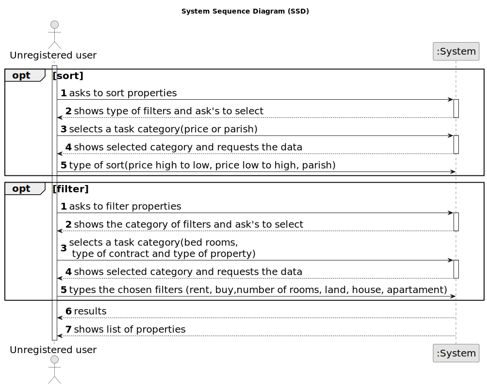

# US 001 - List properties 

## 1. Requirements Engineering

### 1.1. User Story Description

As an unregistered user, I want to display listed properties.

### 1.2. Customer Specifications and Clarifications 

**From the specifications document:**

>	In the case of a request for the sale of a property, the owner must provide information on: the type of property (apartment, house or land), the area in m2, the location, the distance from the city centre, the requested price and one or more photographs.

>	If the property is an apartment or a house, the owner also provides: the number of bedrooms, the number of bathrooms, the number of parking spaces and the available equipment,         such as central heating and/or air conditioning.

>In case the property is a house, the existence of a basement, an inhabitable loft, and sun exposure must be registered as well.

>the client is, then, responsible for being able to consult the properties by type, number of rooms, and sort by criteria such as price or the parish where the property is located.

**From the client clarifications:**

>**1- Unregistered users**
>
>**Answer:** Non-authenticated users can only list properties.
>
 
>**2- Property**
>
>**Answer:** The property can’t be in sale and lease at the same time.

>**3- Sorting criteria**
>
>**Answer:** The client should be able to select the type of business (renting or buying), the type of property and the number of rooms. Then, the client should be able to sort properties by price or by parish where the property is located.If the client does not select the type of business, the type of property and the number of rooms, the application should allow the client to sort all properties that are on sale or on renting.

>**4- User Registry**
>
>**Answer:** For now, a non-registered user can only view the list of properties.

>**Q:** The properties can be in sale and lease at the same time?
>
>**A:** No.
> 
> [source](https://moodle.isep.ipp.pt/mod/forum/discuss.php?d=21908#p27613)

>**Q:** When a unregistered user wants to list properties, the list given by the program is sorted by default with which criteria? For example the list is shown with the properties sorted by most recently added?
>
>**A:** Thank you for your suggestion. By default, the list should be shown with the properties sorted by most recently added.
> 
>[source]( https://moodle.isep.ipp.pt/mod/forum/discuss.php?d=22137#p27934)

>**Q:** Can an user filter the properties list for example by a type but choosing multiple values? For example the users wants to see only properties with 3 or 4 rooms. If this is possible, after filtering the list to show only the values chosen, he can sort by ascending/descending?
>
>**A:** The user should select only one value for each feature of the property. By default, the list should be shown with the properties sorted by most recently added.
> 
>[source]( https://moodle.isep.ipp.pt/mod/forum/discuss.php?d=22137#p27934)

>**Q:** In the project description it is stated that "the client is, then, responsible for being able to consult the properties by type, number of rooms, and sort by criteria such as price or the parish where the property is located.". Is the client able to sort properties by only these 4 criteria or is he able to sort properties by any of the properties' characteristics?
>
>**A:** The client should be able to select the type of business (renting or buying), the type of property and the number of rooms. Then, the client should be able to sort properties by price or by parish where the property is located.
>If the client does not select the type of business, the type of property and the number of rooms, the application should allow the client to sort all properties that are on sale or on renting.
> 
>[source](https://moodle.isep.ipp.pt/mod/forum/discuss.php?d=21920#p27628)

 
### 1.3. Acceptance Criteria

* **AC1:** The property can’t be in sale and lease at the same time.
* **AC2:** Non-authenticated users can only list properties.
* **AC3:** For now, a non-registered user can only view the list of properties.

### 1.4. Found out Dependencies

* There is no dependece of us1.

### 1.5 Input and Output Data

**Input Data:**

* Typed date:
	* price 
	* number of bedrooms 
	* type of property
  
* Selected date:
	* price low to high
	* price high to low
    * number of bedrooms(1,2,3...)
    * buy
    * rent

**Output Data:**

* List of houses by the sorting critiria
* (In)Success of the operation

### 1.6. System Sequence Diagram (SSD)

### 1.7 Other Relevant Remarks

* The created task stays in a "not published" state in order to distinguish from "published" tasks.