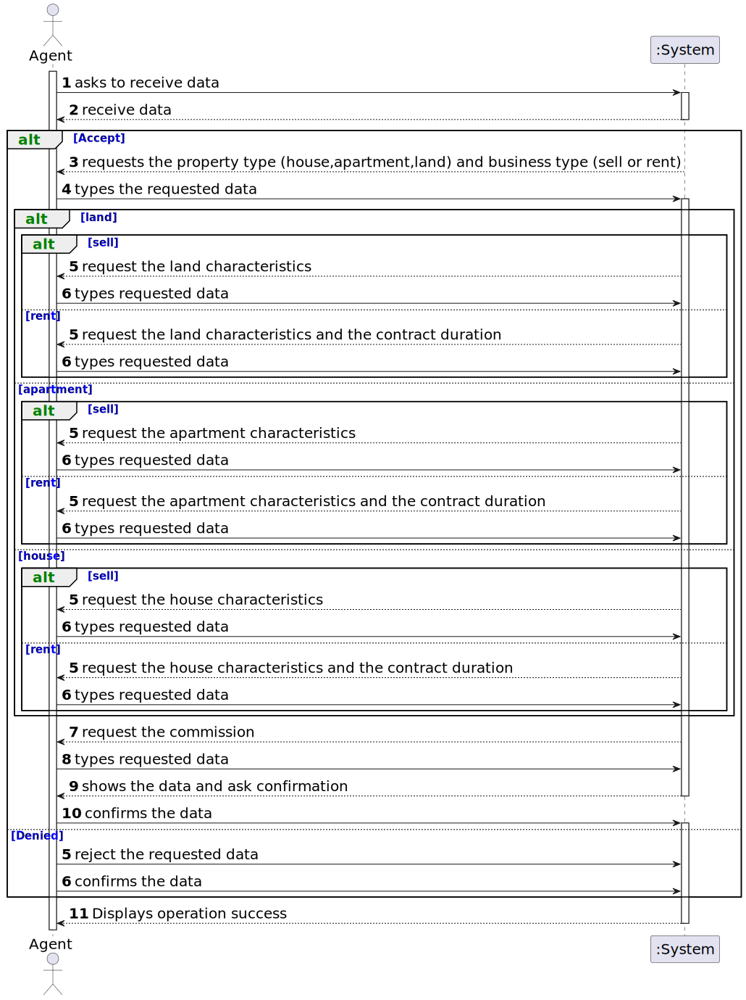

# US 002 - Publish announcement 

## 1. Requirements Engineering

### 1.1. User Story Description

As an agent, I can publish any sale announcement on the system, for example received through a phone call.

### 1.2. Customer Specifications and Clarifications 

**From the specifications document:**

>	The agent receives the information about the property from the concerned owner by meeting with him or receives it through the company's application for the same purpose

>	Upon receiving the order, the agent analyzes and sets the commission and publishes the offer in the system.

**From the client clarifications:**

> **Question:** When a sale order arrives at the agent, what are the acceptance criteria that he (the agent) uses to accept or reject the order? Is there a possibility for an agent to refuse due to a lack of date on the property's characteristics of a property given by the owner? Or when the request arrives at the agent, are all the essential characteristics of the property in question already present?
>
> **Answer:** Yes.
>
> [source](https://moodle.isep.ipp.pt/mod/forum/discuss.php?d=22039)

> **Question:** When the agent receives the phone call (as mentioned in US002) is it the agent who registers the order in the system or has the order already been entered into the system by the owner? Or is the phone call just for the owner to tell the agent that he registered a request in the system?
>  
> **Answer:** The agent registers the order in the system.
>
> [source](https://moodle.isep.ipp.pt/mod/forum/discuss.php?d=22216#p28074)

> **Question:** The act of publishing a sale announcement means that the agent is publishing a new property for sale in the system (receiving the information of the seller and publishing the new property for sale) or is it the buyer giving positive feedback to the agent with intent to buy the property(actually closing a sale, buying a property and de-listing said property)?
>
> **Answer:** In US1 we get "As an agent, I can publish any sale announcement on the system, for example received through a phone call". Additional information related with this question is also avaliable in the project description. Asking the customer something that is clear or has already been clarified is unprofessional.
>
> [source](https://moodle.isep.ipp.pt/mod/forum/discuss.php?d=21974#p27745)

### 1.3. Acceptance Criteria

* **AC1:** USD (Dollar $) is the business currency.
* **AC2:** Area (m2)
* **AC3:** The commission can be a fixed amount or a percentage
* **AC4:** It isn’t possible to submit multiple listing for the same property and type of listing.
* **AC5:** If it is an apartment/house, add the number of bedrooms, number of bathrooms, number of parking spaces, and available equipment such as central heating and/or air conditioning.
* **AC6:** If the property is a house, the existence of a basement, a habitable attic, and the sun exposure should also be recorded.

### 1.4. Found out Dependencies

* There is a strong dependency with us004 since that is where all the information from the customer comes from for the agent to validate and in turn publish

### 1.5 Input and Output Data

**Input Data:**

* Typed date:
	* proprety type,
	* property characteristics,
    * business type,
    * commission

* Selected date:
	* Country

**Output Data:**

* Summary of date entered and confirm Bhutan to confirm
* Operation sucessfully completed message

### 1.6. System Sequence Diagram (SSD)

#### Alternative One

### 1.7 Other Relevant Remarks

* When an agent publishes a property, the information must be sent in a single sub-mission (it cannot be saved to be finished later).