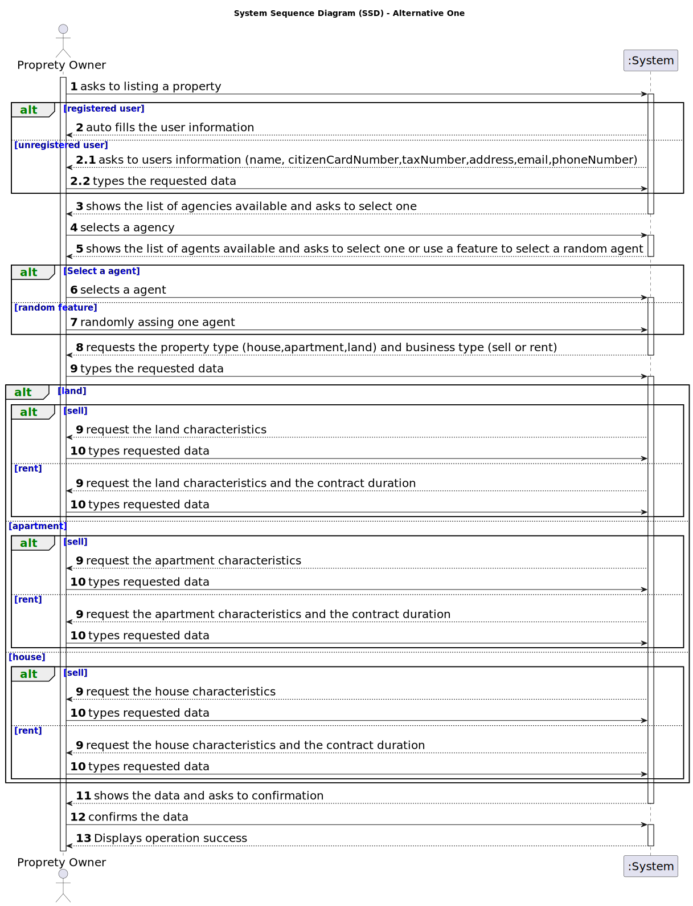

# US 004 - Create a request for listing a property

## 1. Requirements Engineering

### 1.1. User Story Description

As an owner, I intend to submit a request for listing a property sale or rent, choosing the responsible agent. 

### 1.2. Customer Specifications and Clarifications 

**From the specifications document:**

>	Owners go to one of the company's branches and meet with a real estate agent to sell or rent one or more properties, or they can use the company's application for the same purpose.

>	The owner provides property characteristics and the requested price and sends the request to an agent.

**From the client clarifications:**

>**Q**: In a previous question, you answered that, regarding US001 filtering/sorting system, the client should be able to select (from a list) the type of business, the type of property, and the number of rooms. Does this apply too to the process of an owner submitting a request? Or does the owner has to type these characteristics?
>
>**A**: Yes.
>
> [source](https://moodle.isep.ipp.pt/mod/forum/discuss.php?d=22169#p27987)
* * *
>**Q1**: If the owner doesn't select an agent will the platform randomly assign one or the request cannot move to revision? If not, must we assume that all information slots must be filled?
>
>**A1**: Thank you for your suggestion. When filling the property date, the owner should select one agent from the list of agents working in the selected agency. Moreover, the application should include a feature to randomly assign one agent. The address of the owner is not mandatory.
>
>**Q2**: Do requests have any reference/code identifying them with any specific format? What about descriptions (any restrictions, like character limit)? Does that reference carry out with the advertisement?
>
>**A2**: Please choose appropriate date formats for the request. You are a team of experts and you should choose appropriate formats. In the next sprints I will specify some date formats.
>
>**Q3**: When renting, does the owner have any space to clarify any prohibitions or obligations with the property?
>
>**A3**: No.
>
>**Q4**: Does the owner have a limit of requests they can do?
>
>**A4**: No.
>
>**Q5**: Regarding the property’s photographs, is that considered selected date?
>
>**A5**: The owner should input the URI of each file/photograph.
>
> [source](https://moodle.isep.ipp.pt/mod/forum/discuss.php?d=22140#p27938)
* * *
>**Q**: In the case of listing a land property, shall the owner refer if there is a building permit already approved?
>
>**A**: No.
>
> [source](https://moodle.isep.ipp.pt/mod/forum/discuss.php?d=22125#p27920)
* * *
>**Q**: According to the Project Description, the agent when selling a property can charge a flat price comission or a percentage of the sale value, my question here is wether there is a minimum and/or a maximum to each of these types of comissions?
>
>**A**: There is no maximum and the minimum is 0.
>
> [source](https://moodle.isep.ipp.pt/mod/forum/discuss.php?d=22060#p27824)
* * *
>**Q**: When assigning an agent to a property listing, are the available agents shown by the system for the owner to pick? Or does the owner need to provide the agent's information (name, agency,etc)?
>
>**A**: The owner should select one agent from a list of agents that work in the selected agency. The owner should select the agency before selecting the agent.
>
> [source](https://moodle.isep.ipp.pt/mod/forum/discuss.php?d=22036#p27796)
* * *
>**Q**: Does an owner need to be registered in the system to submit a request for a property listing?
>
>**A**: No. When making the request to list a property, the owner should introduce his own date. The Owner attributes are: the name, the citizen's card number, the tax number, the address, the email address and the telephone number.
>
> [source](https://moodle.isep.ipp.pt/mod/forum/discuss.php?d=22025#p27781)
* * *
>**Q**: Is there a designated currency for this business, or should we use USD?
>
>**A**: Please use USD.
>
> [source](https://moodle.isep.ipp.pt/mod/forum/discuss.php?d=22011#p27762)
* * *
>**Q**: Also another question, when publishing a property, if the owner leaves the listing unfinished, can it be saved or stay as as a sketch to be finished later ?
>
>**A**: No.
>
> [source](https://moodle.isep.ipp.pt/mod/forum/discuss.php?d=21983#p27718)
* * *
>**Q**: Is it possible to submit multiple listing for the same property and type of listing?
>
>**A**: No.
>
> [source](https://moodle.isep.ipp.pt/mod/forum/discuss.php?d=21872#p27573)
* * *
>**Q1**: Are there any restrictions on the choice of an Agent?
>
>**A1**: No.
>
>**Q2**: In case the submission of the listing is online may the owner choose any agent?
>
>**A2**: Yes.
>
>**Q3**: In case it is on an agency, must the agent be assigned automatically by the system?
>
>**A3**: The agent that registers the information in the system can choose to assign any agent.
>
> [source](https://moodle.isep.ipp.pt/mod/forum/discuss.php?d=21869#p27570)
* * *
>**Q**: In the Project description, there are only specifications for a Sale. What are the required characteristics for a rental?
>
>**A**: The caracteristics for a rental are the same as the ones for the sale of a property. The rent value is per month. Additionally, we have to define the contract duration.
>
>[source](https://moodle.isep.ipp.pt/mod/forum/discuss.php?d=21867#p27568)

### 1.3. Acceptance Criteria

* **AC1:** USD (Dollar $) is the business currency.

* **AC2:** The address of the owner isn't mandatory.

* **AC3:** The application should include a feature to randomly assign one agent.

* **AC4:** The owner should input the URI of each file/photograph.

* **AC4:** The characteristics for a rental are the same as the ones for the sale of a property. The rent value is per month. Additionally, we must define the contract duration.

* **AC5:** The choice of an Agent has no restrictions.

* **AC6:** If the submission of the listing is online the owner need to choose an agent.

* **AC7:** In case it is on an agency, the agent that registers the information in the system can choose to assign any agent.

* **AC8:** It isn’t possible to submit multiple listing for the same property and type of listing.

### 1.4. Found out Dependencies

* There is a dependency to "US003 register a new employee", since at least one agent must exist to take care of the business.
* There is a dependency to "US002 publish any sale announcement", the owner request must the verify by an agent.

### 1.5 Input and Output Data

**Input Data:**

* Typed date:
	* users information,
	* proprety type,
	* business type,
	* property characteristics
	
* Selected date:
	* Agency,
	* Agent
	

**Output Data:**

* List of all agencies,
* List of all agents,
* Operation sucessfully completed message

### 1.6. System Sequence Diagram (SSD)

**Other alternatives might exist.**

#### Alternative One

### 1.7 Other Relevant Remarks

* When a owner publishes a property the information must be send in one submition (it can't be saved to be finished later).