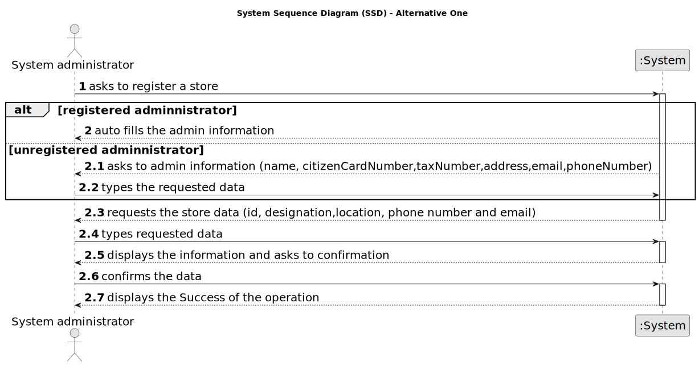

# US 005 - Register a store 

## 1. Requirements Engineering

### 1.1. User Story Description

As a system administrator, I want to register a store.

### 1.2. Customer Specifications and Clarifications 

**From the specifications document:**

>	systems administrator will be responsible for registering (...) branches of the network (specifying the designation, the location, the email address and the contact telephone number)  

**From the client clarifications:**

>**Q**: To register an employee I need to allocate him with a branch. To register a branch I need an employee (to be local manger) but I can't create the employee because I have no branch and I can’t create the branch because I have no employee.
>
>**A**: Thank you for identifying this issue. We already updated the project description. When a store is created in the system, the System Administrator should not set the Store Manager. When registering a store, the System Administrator should introduce the following information: an ID, a designation/name, a location, a phone number and an e-mail address.
>
> [source](https://moodle.isep.ipp.pt/mod/forum/discuss.php?d=22042#p27802)
* * *
>**Q1**: Could you please share how will the designation of new stores be made, is there a pattern perhaps?
>
>**A1**: There is no pattern. The System Administrator can introduce any designation/name. The designation/name should have at most forty characters.
>
>**Q2**: Will the System Administrator be able to choose a location from a list of available locations (defined elsewhere in the application) or will he be able to submit any location he wants?
>
>**A2**: The System Administrator can submit any location.
>
>**Q3**: Are the local managers restricted to their initial location or can they be re-registered/reassigned to other locations?
>
>**A3**: For now this is not a problem.
>
> [source](https://moodle.isep.ipp.pt/mod/forum/discuss.php?d=22026#p27782)
* * *
>**Q**: Does a store designation have to be detailed? If so, will the system administrator have to register the name, email, phone number or anything else? Does the location of a store have to be detailed as well? If yes, will the system administrator have to record the address, postcode or something else? To register the store manager, does the system administrator only register the manager's name? If not, will the system administrator have to register the manager as if he were an employee (except the agent he is assigned to)?
>
>**A**: When registering a store, the System Administrator should introduce the following information: an ID, a designation/name, a location, a local manager, a phone number and an e-mail address. The ID is an integer number. An example of the store location is: 71 ST. NICHOLAS DRIVE, NORTH POLE, FAIRBANKS NORTH STAR, AK, 99705. An example phone number is (907) 488-6419.
>
> [source](https://moodle.isep.ipp.pt/mod/forum/discuss.php?d=21980#p27715)
* * *
>**Q1**: When a System Administrator (admin) makes a request to register a new employee or a new network branch (or any other alteration), does the System ask for the admin credentials (login, password)?
>
>**A1**: The System Administrator should be logged in the application.
>
>**Q2**: Lastly, can there be more than one admin?
>
>**A2**: No.
>
> [source](https://moodle.isep.ipp.pt/mod/forum/discuss.php?d=21934#p27647)
* * *

### 1.3. Acceptance Criteria

* **AC1:** The System Administrator can introduce any designation/name,but it should have at most forty characters.
* **AC2:** The System Administrator can submit any location.
* **AC3:** The ID is an integer number. An example of the store location is: 71 ST. NICHOLAS DRIVE, NORTH POLE, FAIRBANKS NORTH STAR, AK, 99705. An example phone number is (907) 488-6419.
* **AC4:** There is just one System Administrator

### 1.4. Found out Dependencies

* There are no dependencies in this US

### 1.5 Input and Output Data

**Input Data:**

* Typed date:
	* an id, 
	* a designation, 
	* a location, 
	* a phone number,
	* an email

**Output Data:**

* (In)Success of the operation

### 1.6. System Sequence Diagram (SSD)

**Other alternatives might exist.**

#### Alternative One

