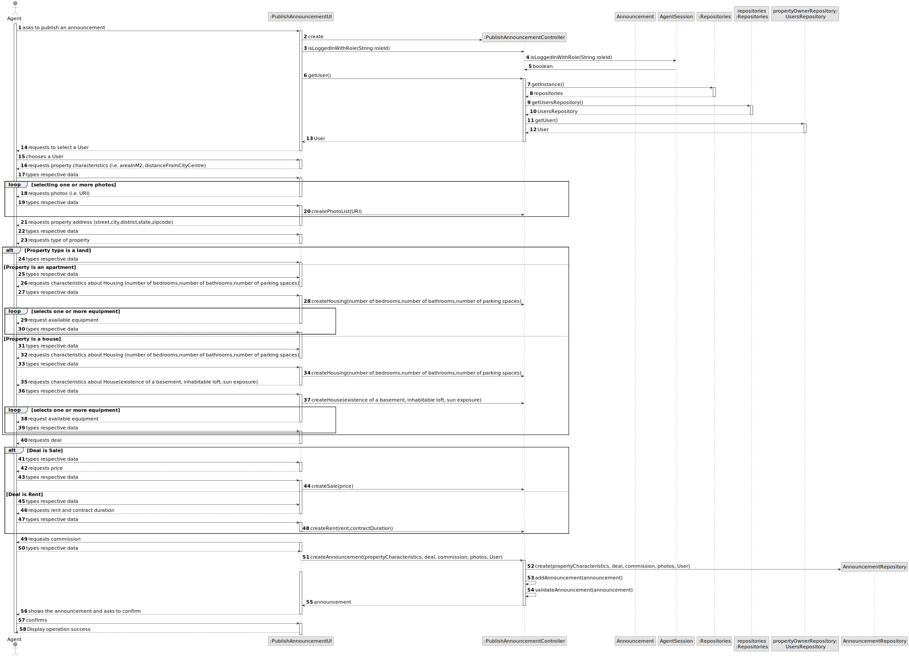
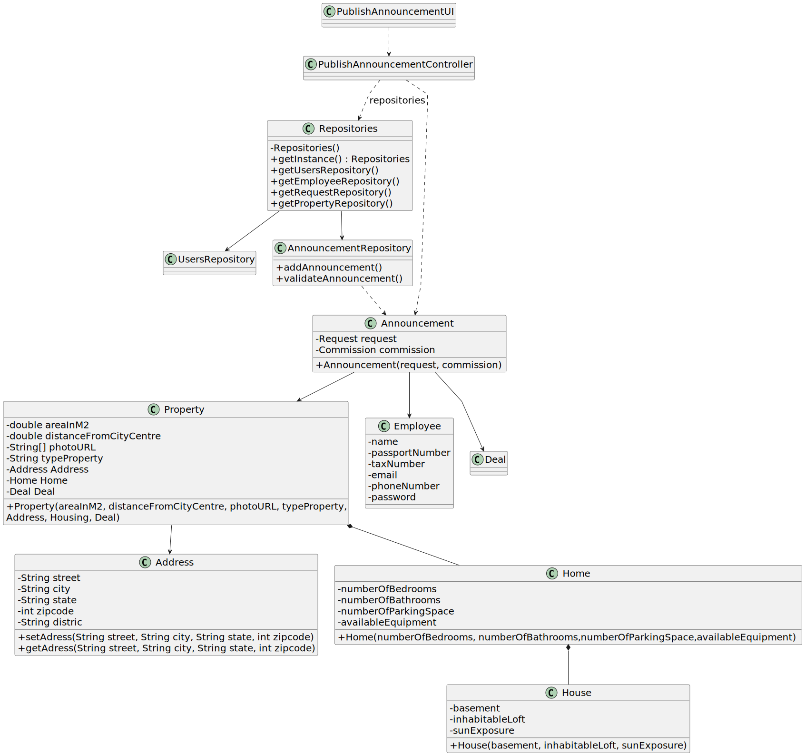

# US 002 - Publish announcement 

## 3. Design - User Story Realization 

### 3.1. Rationale

**SSD - Alternative 1 is adopted.**

| Interaction ID                                                        | Question: Which class is responsible for... | Answer                        | Justification (with patterns)                                                                                 |
|:----------------------------------------------------------------------|:--------------------------------------------|:------------------------------|:--------------------------------------------------------------------------------------------------------------|
| Step 1:asks to advertise a request                                    | 	... interacting with the actor?            | PublishAnnouncementUI         | Pure Fabrication: there is no reason to assign this responsibility to any existing class in the Domain Model. |
| Step 2: shows the list of users                                       | 	... coordinating the US?                   | PublishAnnouncementController | Controller                                                                                                    |
| 			  		                                                               | ... get the User list?                      | UserRepository                | IE: knows and stores all users/ Pure Fabrication                                                              |
| Step 3: chooses a user		  		                                          | ...select a User                            | PublishAnnouncementUI         | Pure Fabrication                                                                                              |
| Step 4: requests property address                                     | ...saving the inputted date?                | Address                       | Information Expert: object has its own date.                                                                  |          
| Step 5: requests photos (i.e URL)                                     | ... where is going?                         | Property                      | IE: is responsible for own this date.                                                                         |
| Step 6: requests type of property                                     | ...where is going?                          | Property                      | IE: is responsible for own this date.                                                                         |
| Step 7: request the property characteristics (Land,Apartment,House) | ...where is going?                          | Property                      | IE: is responsible for own this date.                                                                         |
| Step 8: request the deal type (Rent,Sale)                             | ...where is going?                          | Deal                          | IE: is responsible for own this date.                                                                         |
| Step 9: request the commission (percent/fixed)                        | ...where is going?                          | Commission                    | IE: is responsible for own this date.                                                                         |

### Systematization ##

According to the taken rationale, the conceptual class promoted to software class are: 

 * Request
 * Commission

Other software classes (i.e. Pure Fabrication) identified: 

 * PublishAnnouncementUI  
 * PublishAnnouncementController
 * UserRepository

## 3.2. Sequence Diagram (SD)

  

## Full Diagram

  

  

## 3.3. Class Diagram (CD)

  

