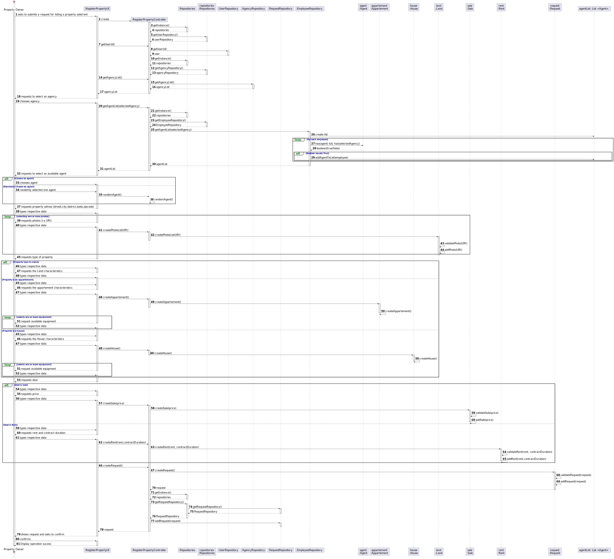

# US 004 - Create a request for listing a property

## 3. Design - User Story Realization 

### 3.1. Rationale

**SSD - Alternative 1 is adopted.**

| Interaction ID | Question: Which class is responsible for... | Answer| Justification (with patterns)|
|:-------------  |:--------------------- |:---------------------|:---------------------------------------------|
| Step 1: asks to listing a property  |	... interacting with the actor? | RequestListingUI | Pure Fabrication: there is no reason to assign this responsibility to any existing class in the Domain Model. |
| Step 2: shows the list of agents | ...coordinating the US?  | RequestListingController | Controller |
| 	      |	... get the agency list? | AgencyRepository | IE: knows and stores all agencies/ Pure Fabrication |
| Step 3: chooses agency |	...select a Agency | RequestListingUI | Pure Fabrication|
| Step 4: request to select an available agent    |... obtaining the list with all of the agents | EmployeeRepository | IE: knows and all agents/ Pure Fabrication |
| Step 5: chooses agent | ...showing the list with all of the agents| RequestListingUI | Pure Fabrication |
| Step 6: requests property address | 	...saving the inputted date?| Address| Information Expert: object has its own date.|          
| Step 7: types respective date	| 	... validating all date (local validation)?| Address | IE: owns its date.| 
| Step 8: requests photos (i.e URL) | 	... where is going? | Property | IE: is responsible for own this date.|
| Step 9: requests type of property|...where is going? | Property | IE: is responsible for own this date. |
| Step 10: request the property characteristics (Land,Appartement,House) | ...where is going? | Property | IE: is responsible for own this date.|
| Step 10: request the deal type (Rent,Sale) | ...where is going? | Deal | IE: is responsible for own this date.|

### Systematization ##

According to the taken rationale, the conceptual classes promoted to software classes are: 

 * House
 * Home
 * Appartement
 * Property
 * Deal

Other software classes (i.e. Pure Fabrication) identified: 

 * RequestListingUI  
 * RequestListingController
 * EmployeeRepository
 * AgencyRepository
 

## 3.2. Sequence Diagram (SD)

  

## Full Diagram

  

  

## 3.3. Class Diagram (CD)

  

