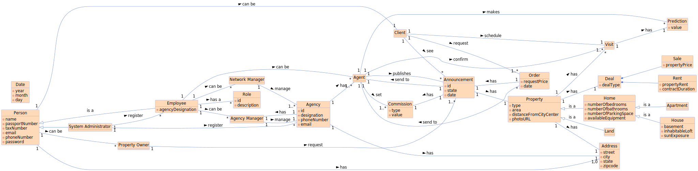

# Analysis

The construction process of the domain model is based on the client specifications, especially the nouns (for _concepts_) and verbs (for _relations_) used. 

## Rationale to identify domain conceptual classes ##
To identify domain conceptual classes, start by making a list of candidate conceptual classes inspired by the list of categories suggested in the book "Applying UML and Patterns: An Introduction to Object-Oriented Analysis and Design and Iterative Development". 

### _Conceptual Class Category List_ ###

**Business Transactions**

* Property;

---

**Transaction Line Items**

* Land;
* House;
* Apartment;

---

**Product/Service related to a Transaction or Transaction Line Item**

* Request (made by a client);
* Anouncement (request by an owner);

---

**Transaction Records**

*  Anouncement;

---  

**Roles of People or Organizations**

* Agent
* Agency Manager
* Network Manager
* System Administrator
* Client
* Property Owner

---

**Places**

* Agency;
* Property;
---

**Noteworthy Events**

* Predictions (Agent);
* Commission(Agent);
* Visits (Client);

---

**Physical Objects**

* Property;

---

**Descriptions of Things**

* Property;
* Address;
* User;

---

**Catalogs**

*  

---

**Containers**

*  

---

**Elements of Containers**

*  

---

**Organizations**

*  Real Estate USA (Company)

---

**Other External/Collaborating Systems**

*  Phone calls;
*  Emails;

---

**Records of finance, work, contracts, legal matters**

* Contract Duration (just on properties for lease)

---

**Financial Instruments**

*  USD (United State Dollar)

---

**Documents mentioned/used to perform some work/**

* Prediction (made by the agent)
* Anouncement (publishe by an agent , requested by the owner)
---

### **Rationale to identify associations between conceptual classes** ###

An association is a relationship between instances of objects that indicates a relevant connection and that is worth of remembering, or it is derivable from the List of Common Associations: 

+ **_A_** is physically or logically part of **_B_**
+ **_A_** is physically or logically contained in/on **_B_**
+ **_A_** is a description for **_B_**
+ **_A_** known/logged/recorded/reported/captured in **_B_**
+ **_A_** uses or manages or owns **_B_**
+ **_A_** is related with a transaction (item) of **_B_**
+ etc.

| Concept (A) |  Association |  Concept (B) |
|----------	  |:------------:| ------:        |
|User         | can be       |  Client              |
|             | can be       |  Proprety Owner      |
|             | has          |  Address             |
|Employee     | is a         |  User                |
|             | can be       |  Agent               |
|             | can be       |  Agency Manager      |
|             | can be       |  Network Manager     |
|             | can be       |  System Administrator|
|System Administrator | register | Employee |
|                     | register | Agency   |
|Client          | schedule   | Visit       |
|                | make       | Request     |
|                | see        | Anouncement |
|Proprety Owner  | request    | Anouncement |
|Agent           | confirm    | Visit       |
|                | makes      | Prediction  |
|                | set        | Commission  |
|                | publishes  | Anouncement |
|Agency        | has        | Agency Manager| 
|              | has        | Agent         | 
|Agency Manager | manage   | Agency         |
|Network Manager| manage   | Agencys        |
|Request        | has      | Property       |
|               | send to  | Agent          |
|Apartement     | is a     | Home           |
|House          | is a     | Home           |
|Home           | is a     | Property       |
|Land           | is a     | Property       |
|Anouncement    | can be   | Lease          |
|Anouncement    | can be   | Sale           |
|Anouncement    | has      | Commission     |
|Anouncement    | send to  | Agent          |

## Domain Model

