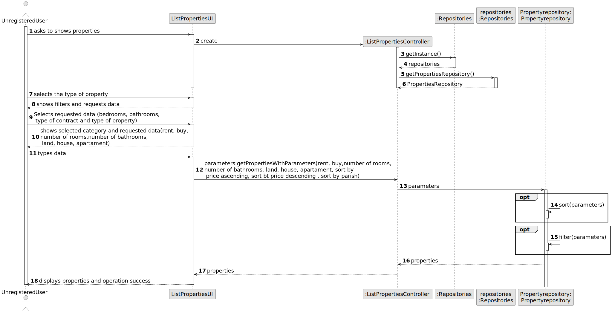
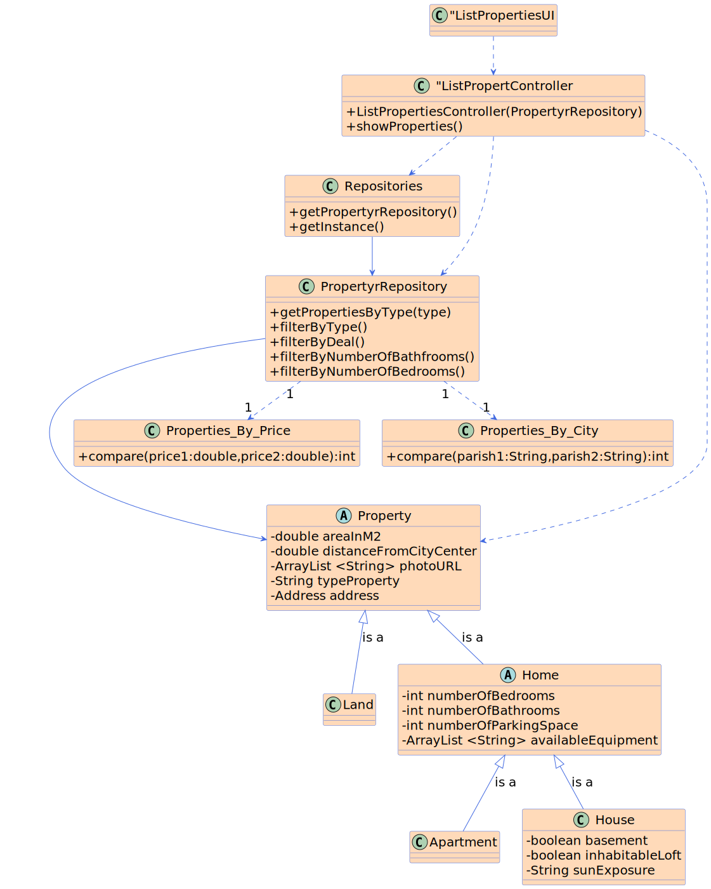

# US 001 - List properties

## 3. Design - User Story Realization

### 3.1. Rationale

**SSD - Alternative 1 is adopted.**

| Interaction ID                                            | Question: Which class is responsible for...         | Answer                   | Justification (with patterns)                                                                                 |
|:----------------------------------------------------------|:----------------------------------------------------|:-------------------------|:--------------------------------------------------------------------------------------------------------------|
| Step 1 : asks to show properties		                        | 	... interacting with the actor?                    | ListPropertiesUI         | Pure Fabrication: there is no reason to assign this responsibility to any existing class in the Domain Model. |
| 			  		                                                   | 	... coordinating the US?                           | ListPropertiesController | Controller                                                                                                    |
| 			  		                                                   | 	... instantiating the repositories?                | Repository               | Creator                                                                                                       |
| Step 2 : selects type of property                         | obtaining the properties instances?                 | PropertyRepository       | Controller                                                                                                    |
| Step 3  : shows filters and sorting types requests date		 | 	...showing the list the filters ans sorting types? | ListPropertiesUI         | IE: object created in step 1 has its own date.                                                                |
| Step 4  :		types date                                     | 	... saving the selected category?                  | ListPropertyController   | Controller                                                                                                    |
| Step 5 : getPropertiesWithParameters                      | filter and sorting?                                 | PropertyRepository       | IE                                                                                                            |
| Step 7 : display properties and operation success         | 	... informing operation success?                   | ListPropertyUI           | IE: is responsible for user interactions.                                                                     | 

### Systematization ##

According to the taken rationale, the conceptual classes promoted to software classes are:

* Repositories
* PropertiesRepository

Other software classes (i.e. Pure Fabrication) identified:

* ListPropertiesUI
* ListPropertiesController
* PropertyRepository

## 3.2. Sequence Diagram (SD)

### Alternative 1 - Full Diagram

This diagram shows the full sequence of interactions between the classes involved in the realization of this user story.

## 3.3. Class Diagram (CD)

