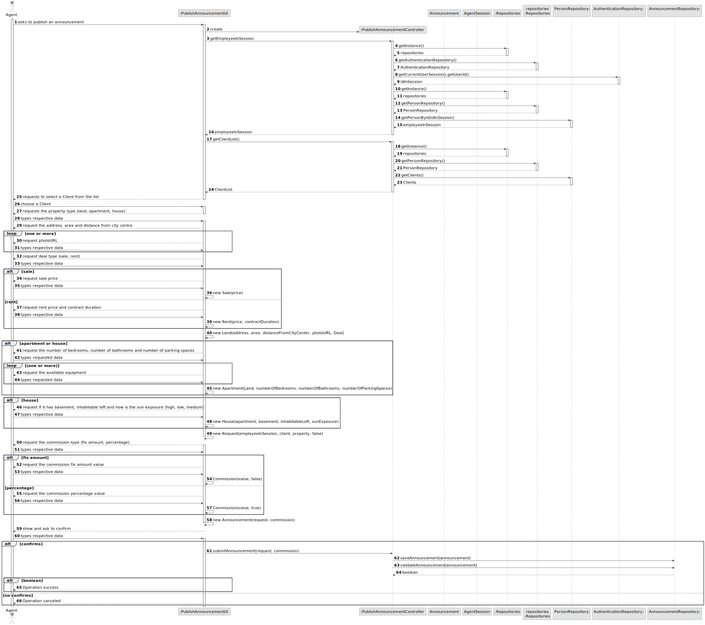
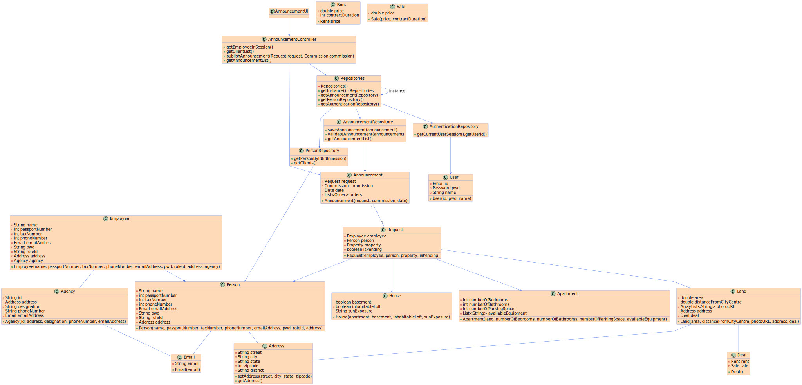

# US 002 - Publish announcement 

## 3. Design - User Story Realization 

### 3.1. Rationale

**SSD - Alternative 1 is adopted.**

| Interaction ID                                                        | Question: Which class is responsible for... | Answer                        | Justification (with patterns)                                                                                 |
|:----------------------------------------------------------------------|:--------------------------------------------|:------------------------------|:--------------------------------------------------------------------------------------------------------------|
| Step 1:asks to advertise a request                                    | 	... interacting with the actor?            | PublishAnnouncementUI         | Pure Fabrication: there is no reason to assign this responsibility to any existing class in the Domain Model. |
| Step 2: get employee in session                                       | 	... interacting with the actor?            | PublishAnnouncementController | Pure Fabrication: there is no reason to assign this responsibility to any existing class in the Domain Model. |
| Step 3: shows the list of clients                                     | 	... coordinating the US?                   | PublishAnnouncementController | Controller                                                                                                    |
| Step 4: chooses a client		  		                                        | ...select a Client                          | PublishAnnouncementUI         | Pure Fabrication                                                                                              |
| Step 5: requests type of property                                     | ...where is going?                          | Property                      | IE: is responsible for own this date.                                                                         |
| Step 6: request the property characteristics (land, apartment, house) | ...where is going?                          | Property                      | IE: is responsible for own this date.                                                                         |
| Step 7: request the commission (fix amount, percentage)               | ...where is going?                          | Commission                    | IE: is responsible for own this date.                                                                         |
| Step 8: shows the confirmation                                        | 	... coordinating the US?                   | PublishAnnouncementController | Controller                                                                                                    |
### Systematization ##

According to the taken rationale, the conceptual class promoted to software class are: 

  * Agency
  * Announcement
  * Commission
  * Employee
  * Person
  * Request
  * Deal
  * Rent
  * Sale
  * Apartment
  * House
  * Land
  * Address
  * Date
  * Utils

Other software classes (i.e. Pure Fabrication) identified: 

 * PublishAnnouncementUI  
 * PublishAnnouncementController
 * AnnouncementRepository
 * AuthenticationRepository
 * PersonRepository

## 3.2. Sequence Diagram (SD)

  

## Full Diagram

  

  

## 3.3. Class Diagram (CD)

  

