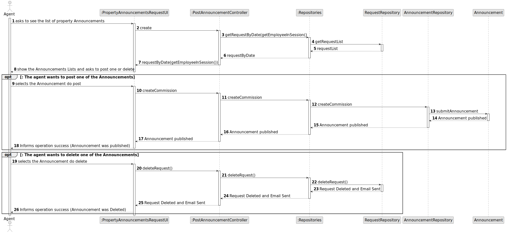
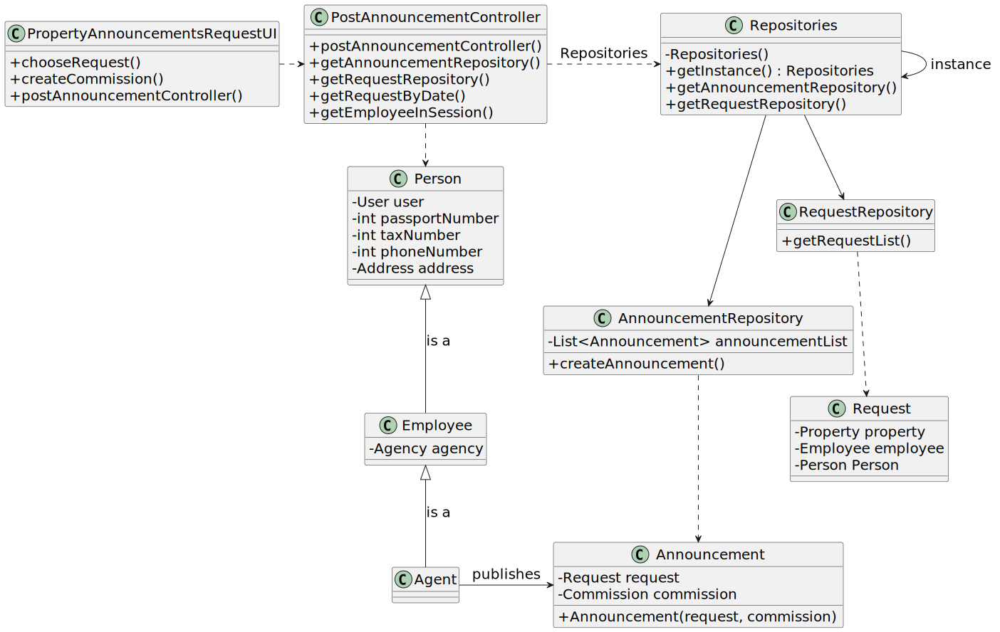

# US 008 - See the list of property announcement requests and post an announcement

## 3. Design - User Story Realization 

### 3.1. Rationale

**SSD - Alternative 1 is adopted.**

| Interaction ID | Question: Which class is responsible for... | Answer               | Justification (with patterns)                                                                                 |
|:-------------  |:--------------------- |:---------------------|:--------------------------------------------------------------------------------------------------------------|
| Step 1  : asks to see the list of property announcements|	... interacting with the actor? |:PropertyAnnouncementsRequestUI| Pure Fabrication: there is no reason to assign this responsibility to any existing class in the Domain Model. |
| 			  		 |	... coordinating the US? |PostAnnouncementController| Controller                                                                                                    |
| Step 2 : shows the list of property Announcements and asks to select or delete one|... showing the list of property Announcements|PropertyAnnouncementsRequestUI|Pure Fabrication    |
|               | ... who has all the announcements ? |RequestRepository | IE: is responsible for  user interactions
|       |... who has all of the request information ?|Request | Pure Fabrication
| Step 3  : choose the announcement to publish	 |	...interacting with the actor? |PropertyAnnouncementsRequestUI| Pure Fabrication|
| |... publishing the announcement? |PostAnnouncementController | Controller
| Step 4 : operation success|	...informs operation success? |PropertyAnnouncementsRequestUI| Pure Fabrication               |
|Step 5 : choose the announcement to delete | ... interacting with the actor |PropertyAnnouncementsRequestUI | Pure Fabrication
| |... deleting the announcement? |PostAnnouncementController | Controller| 
|Step 6: informs operation success |... informs operation success? |PropertyAnnouncementsRequestUI |Pure Fabrication| 

### Systematization ##

According to the taken rationale, the conceptual classes promoted to software classes are: 

 * RequestRepository
 * AnnouncementRepository
 * Request

Other software classes (i.e. Pure Fabrication) identified: 

 * PropertyAnnouncementsRequestUI
 * PostAnnouncementController

## 3.2. Sequence Diagram (SD)

### Alternative 1 - Full Diagram

This diagram shows the full sequence of interactions between the classes involved in the realization of this user story.

## 3.3. Class Diagram (CD)

