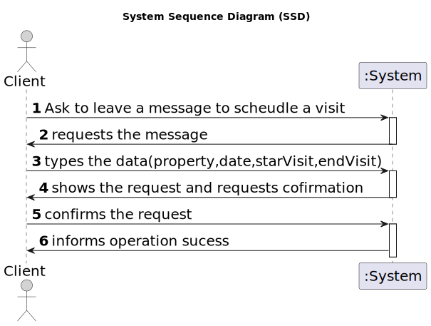

# US 009 - Register to buy, rent or buy a property

## 1. Requirements Engineering

### 1.1. User Story Description

> As an unregistered user, I want to register in the system to buy, sell or rent properties.

### 1.2. Customer Specifications and Clarifications 

**From the specifications document:**

>	When the client decides to buy/rent the property, he sends a request for the purchase/lease of the property to the agent.

>   Owners go to one of the company's branches and meet with a real estate agent to sell or rent one or more properties, or they can use the company's application for the same purposes.

> All those who wish to use the application must be authenticated with a password of seven alphanumeric characters, including three capital letters and two digits.

**From the client clarifications:**

>**Q1**: Does the client provide (by typing) their name and phone number for the message, regardless of whether or not that information is already available to the system?
>**A1**: The information available in the system should be used. The client does not need to type the name and phone number.

>**Q2**: Is all the required data for the message typed, or is any of it selected?
> 
>**A2**: For now the information should be typed.

>**Q1**: In the message what is the characteristic to identify the property to visit? Can we use the location?
> 
>**A1**: The message should be associated with a property. Please check AC1. The client should select a property that he wants to visit before making the visit request.

>**Q2**:When sending the message, is the visit immediately scheduled after being validated by the system, or is it necessary for the agent to approve it?
>**A2**: No, the client is only making a visit request.

>**Q1**: In AC2, when the suggestion of date and time is sent, is there a standard duration for the visit or is it mandatory to fill in a start time and an end time for the visit?
> 
>**A1**: There is no standard duration to schedule a visit. The client should define his availability specifying the start time and the end time for the visit.

>**Q2**: In AC2, can any time be used or are we limited to certain hours?
> 
>**A2**: Any time can be used.

>**Q3**: Also in AC2, should we use the 12am/pm or 24-hour time format?
> 
>**A3**: Please use 24-hour time format.

>**Q1**: On US9 AC1 it is says: "AC1. A list of available properties must be shown, sorted from the most recent entries to the oldest." Does this mean that we can only have the option to make contact in this type of sort?
> 
>**A1**: No. AC1 is the default sorting method.

>**Q2**: When we list in another way, should not be possible to have the option to schedule a visit?
> 
>**A2**: After sorting the properties, the cliente can still schedule a visit.

>
> [source](https://moodle.isep.ipp.pt/mod/forum/discuss.php?d=22430#p28365)
* * *
### 1.3. Acceptance Criteria

* **AC1:** authentication with password of seven alphanumeric characters, including three capital letters and two digits
* **AC2:** The address of the owner is not mandatory.
* **AC3:** The user can choose a password when registering.

### 1.4. Found out Dependencies

* This US have one dependecies

### 1.5 Input and Output Data

**Input Data:**

* Typed date:
	* start time
	* end time
	* day 
	* moth
	* year

**Output Data:**

* Shows (In)Success of the operation

### 1.6. System Sequence Diagram (SSD)

**Other alternatives might exist.**

#### Alternative One

