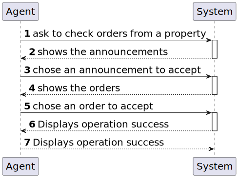

# US 011 - Verify a client order 

## 1. Requirements Engineering

### 1.1. User Story Description

>  As an agent, I want to list real estate purchase orders from a chosen announcement, to accept or decline a purchase order for a property.

### 1.2. Customer Specifications and Clarifications 

**From the specifications document:**

>  The agent receives the information about the property from the concerned owner by the company's application for the same purpose

>  After accepting or declining, an email notification should be sent to the customer

**From the client clarifications:**

>**Q**: When the agent declines an order, she has to be removed from the list and system?
>
>**A**: The order should be removed from the list but not from the system.
>
> [source](https://moodle.isep.ipp.pt/mod/forum/discuss.php?d=22846)
* * *

>**Q**: Does grouping purchase orders by property mean that only properties are displayed, and only after a property is selected are its requests shown? Or are all the requests shown but requests of the same property are shown together?
>
>**A**: The system should show (to the agent) a list of properties that have purchase orders. For each property the system should show a list of purchase orders. Typically we have a small number of purchase orders and we want all orders shown (by property) without selecting a property in particular.
>
> 
>**Q**: When properties are sorted form oldest to most recent, does this relate to when the property was added to the system or the property's date of construction?
>
>**A**: This sorting should be made using the date when the property announcement was published by the agent.
> 
> [source](https://moodle.isep.ipp.pt/mod/forum/discuss.php?d=23086#p29218)
* * *

>**Q**: Regarding US011 should we provide all the property characteristics to assist agents in choosing the appropriate purchase order? If so, is it required to display the amount established by the property owner?
>
>**A**: Yes. Yes.
>
> [source](https://moodle.isep.ipp.pt/mod/forum/discuss.php?d=22930#p28995)
* * *

### 1.3. Acceptance Criteria

* **AC1:**  The list of purchase orders should be grouped by property. The properties should be sorted from the oldest to the most recent one. For each property, the list of purchase orders should be sorted by the amount offered, the highest offer must appear first.
* **AC2:**  For each offer, the agent must be able to accept or decline it. The action of accepting or declining an offer should trigger an email notification to the client.
* **AC3:**  When a purchase order is accepted, all the other orders should be declined, and a message sent to the client.
* **AC4:**  If a property does not contain any offers, the system should show an empty list of offers.

### 1.4. Found out Dependencies

* There is a dependency with us004, since the information to analyze comes from there
* There is a strong dependence with us003, being fundamental to obtain the necessary permissions to use us011

### 1.5 Input and Output Data

**Input Data:**

* Typed date:

  * chosen announcement
  * chosen order
  * check choice (Accept/Denied)

**Output Data:**

* show announcements
* show orders
* (In)Success of the operation

### 1.6. System Sequence Diagram (SSD)

