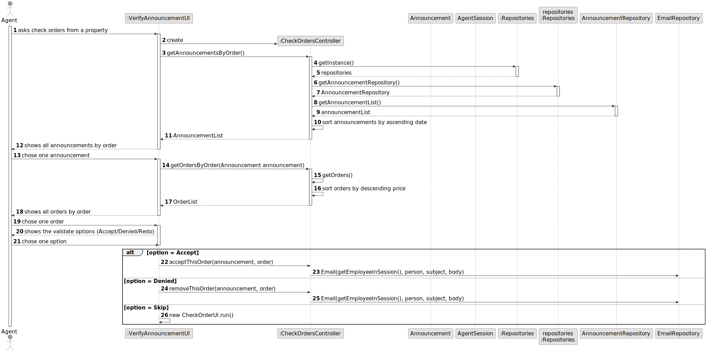
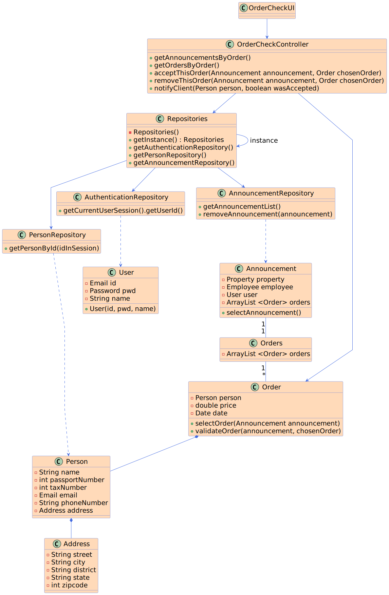

# US 011 - Check orders from announcement 

## 3. Design - User Story Realization 

### 3.1. Rationale

| Interaction ID                                                  | Question: Which class is responsible for... | Answer                 | Justification (with patterns)                                                                                 |
|:----------------------------------------------------------------|:--------------------------------------------|:-----------------------|:--------------------------------------------------------------------------------------------------------------|
| Step 1  : asks to see the list of orders from announcement      | 	... interacting with the actor?            | :OrderCheckUI          | Pure Fabrication: there is no reason to assign this responsibility to any existing class in the Domain Model. |
| 			  		                                                         | 	... coordinating the US?                   | OrderCheckController   | Controller                                                                                                    |
| Step 2 : shows the list of announcements and asks to select one | ... showing the list of announcements       | OrderCheckUI           | Pure Fabrication                                                                                              |
|                                                                 | ... who has all the announcements ?         | AnnouncementRepository | IE: is responsible for  user interactions                                                                     |
| Step 3  : select the announcement to open	                      | 	...interacting with the actor?             | OrderCheckUI           | Pure Fabrication                                                                                              |
|                                                                 | ... publishing the announcement?            | OrderCheckController   | Controller                                                                                                    |
| Step 4 : shows the list of orders and asks to select one        | ... showing the list of orders              | OrderCheckUI           | Pure Fabrication                                                                                              |
|                                                                 | ... who has all the announcements ?         | AnnouncementRepository | IE: is responsible for  user interactions                                                                     |
| Step 5  : select the order to open	                             | 	...interacting with the actor?             | OrderCheckUI           | Pure Fabrication                                                                                              |
| Step 6 : denied or accept the order                             | ... interacting with the actor              | OrderCheckUI           | Pure Fabrication                                                                                              |
| Step 7 : operation success                                      | 	...informs operation success?              | OrderCheckUI           | Pure Fabrication                                                                                              |
|                                                                 | ... accept the announcement?                | OrderCheckController   | Controller                                                                                                    |
|                                                                 | ... denied the announcement?                | OrderCheckController   | Controller                                                                                                    |
### Systematization ##

According to the taken rationale, the conceptual classes promoted to software classes are: 

* Announcement
* Employee
* Person
* Deal
* Date
* Utils

Other software classes (i.e. Pure Fabrication) identified: 

 * OrderCheckUI  
 * OrderCheckController
 * AnnouncementRepository
 * AuthenticationRepository
 * PersonRepository

## 3.2. Sequence Diagram (SD)

### Full Diagram

This diagram shows the full sequence of interactions between the classes involved in the realization of this user story.

## 3.3. Class Diagram (CD)

