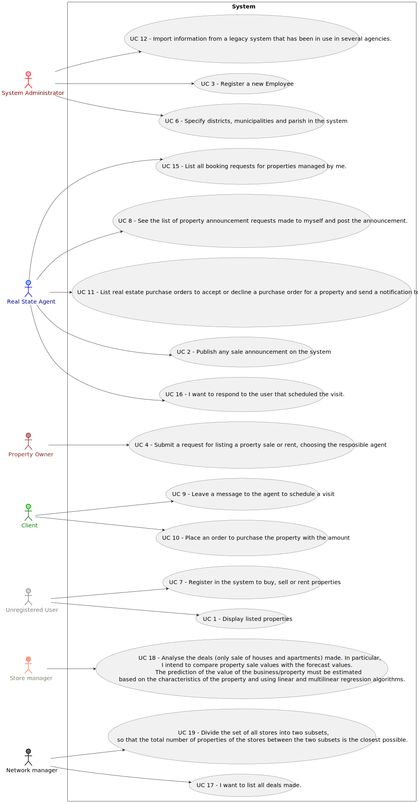

# Use Case Diagram (UCD)

**In the scope of this project, there is a direct relationship of _1 to 1_ between Use Cases (UC) and User Stories (US).**

However, be aware, this is a pedagogical simplification. On further projects and curricular units might also exist _1 to
N **and/or** N to 1 relationship between US and UC.

 

**For each UC/US, it must be provided evidences of applying main activities of the software development process (
requirements, analysis, design, tests and code). Gather those evidences on a separate file for each UC/US and set up a
link as suggested below.**

# Use Cases / User Stories

| UC/US  | Description                                                                                                                                                   |                   
|:-------|:--------------------------------------------------------------------------------------------------------------------------------------------------------------|
| US 001 | [(client)Display listed properties](../../us001/Readme.md)                                                                                                    |
| US 002 | [(agent)Publish any sale announcement](../../us002/Readme.md)                                                                                                 |
| US 003 | [(admin)Registe a new employee](../../us003/Readme.md)                                                                                                        |
| US 004 | [(client)Request for listing a property  and choose the responsible agent](../../us004/Readme.md)                                                             |
| US 005 | [(admin)Registe a store](../../us005/Readme.md)                                                                                                               |
| US 006 | [(admin)Specify districts, municipalities and parish in the system](../../us006/Readme.md)                                                                    |
| US 007 | [(admin)Register in the system to buy, sell or rent properties](../../us007/Readme.md)                                                                        |
| US 008 | [(agent)See the list of property announcement requests made to myself and post the announcement.](../../us008/Readme.md)                                      |
| US 009 | [(client)Leave a message to the agent to schedule a visit](../../us009/Readme.md)                                                                             |
| US 010 | [(client)Place an order to purchase the property with the amount](../../us010/Readme.md)                                                                      |
| US 011 | [(agent) List real estate purchase orders to accept or decline a purchase order for a property. After accepting or declining, an email notification should be sent to the customer](../../us011/Readme.md) |
| US 012 | [(system administrator) Import information from a legacy system that has been in use in several agencies. ](../../us012/Readme.md) |
| US 015 | [(agent) intend to list all booking requests for properties managed by me.](../../us015/Readme.md) |
| US 016 | [(agent) respond to the user that scheduled the visit.  ](../../us016/Readme.md) |
| US 017 | [(network manager) List all deals made. ](../../us017/Readme.md) |
| US 018 | [(store manager) Analyse the deals (only sale of houses and apartments) made. In particular, I intend to compare property sale values with the forecast values. The prediction of the value of the business/property must be estimated based on the characteristics of the property and using linear and multilinear regression algorithms.  ](../../us018/Readme.md) |
| US 019 | [(network manager) divide the set of all stores into two subsets, so that the total number of properties of the stores between the two subsets is the closest possible. ](../../us019/Readme.md) |

