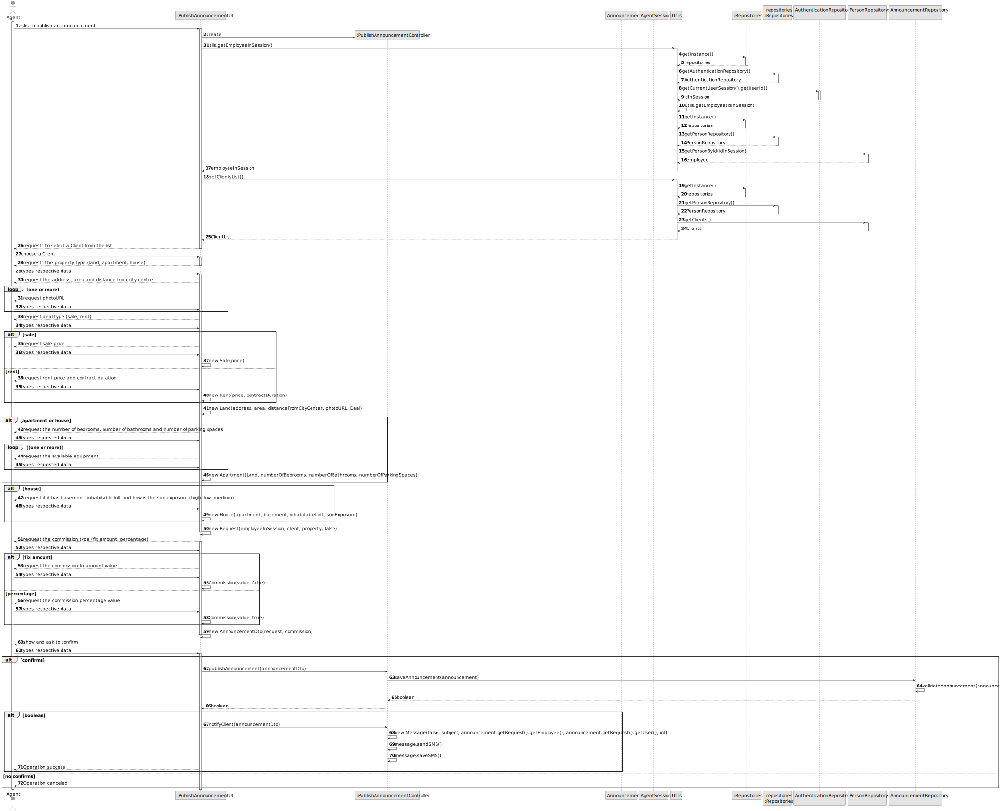
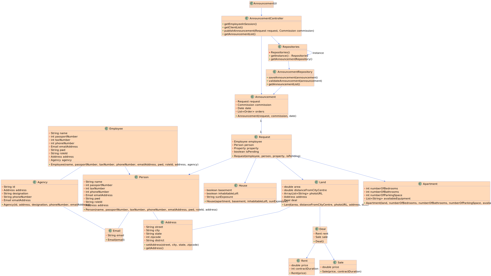

# US 002 - Publish announcement 

## 3. Design - User Story Realization 

### 3.1. Rationale

| Interaction ID                                                        | Question: Which class is responsible for... | Answer                       | Justification (with patterns)                                                                                 |
|:----------------------------------------------------------------------|:--------------------------------------------|:-----------------------------|:--------------------------------------------------------------------------------------------------------------|
| Step 1: asks to advertise a request                                   | 	... interacting with the actor?            | CreateAnnouncementUI         | Pure Fabrication: there is no reason to assign this responsibility to any existing class in the Domain Model. |
| Step 2: get employee in session                                       | 	... interacting with the actor?            | CreateAnnouncementController | Pure Fabrication: there is no reason to assign this responsibility to any existing class in the Domain Model. |
| Step 3: shows the list of clients                                     | 	... coordinating the US?                   | CreateAnnouncementController | Controller                                                                                                    |
| Step 4: chooses a client		  		                                        | ...select a Client                          | CreateAnnouncementUI         | Pure Fabrication                                                                                              |
| Step 5: requests type of property                                     | ...where is going?                          | Property                     | IE: is responsible for own this date.                                                                         |
| Step 6: request the property characteristics (land, apartment, house) | ...where is going?                          | Property                     | IE: is responsible for own this date.                                                                         |
| Step 7: request the commission (fix amount, percentage)               | ...where is going?                          | Commission                   | IE: is responsible for own this date.                                                                         |
| Step 8: send a SMS                                                    | ...where is going?                          | Message                      | IE: is responsible for own this date.                                                                         |
| Step 9: shows the confirmation                                        | 	... coordinating the US?                   | CreateAnnouncementController | Controller                                                                                                    |
### Systematization ##

According to the taken rationale, the conceptual class promoted to software class are:

  * Model's
    * Agency
    * Announcement
    * Commission
    * Employee
    * Person
    * Request
    * Deal
    * Rent
    * Sale
    * Apartment
    * House
    * Land
    * Address
    * Date
    * Message
    
        
    
  * Dto's
    * AgencyDTO
    * AnnouncementDTO
    * CommissionDTO
    * EmployeeDTO
    * PersonDTO
    * RequestDTO
    * DealDTO
    * RentDTO
    * SaleDTO
    * ApartmentDTO
    * HouseDTO
    * LandDTO
    * AddressDTO
    * DateDTO
    
        
    
  * Other software classes (i.e. Pure Fabrication) identified: 

    * CreateAnnouncementUI  
    * CreateAnnouncementController
    * AnnouncementRepository
    * Utils
      * AuthenticationRepository
      * PersonRepository

## 3.2. Sequence Diagram (SD)

  

## Full Diagram

  

  

## 3.3. Class Diagram (CD)

  

