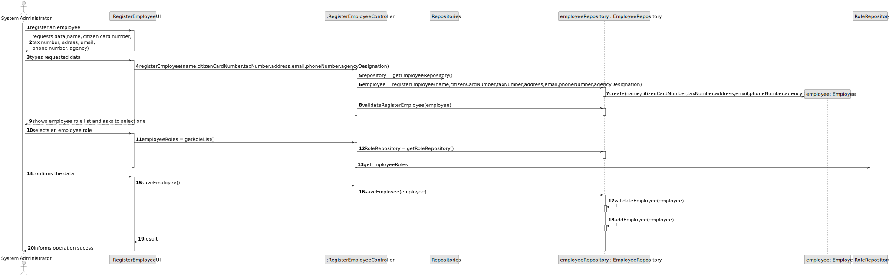
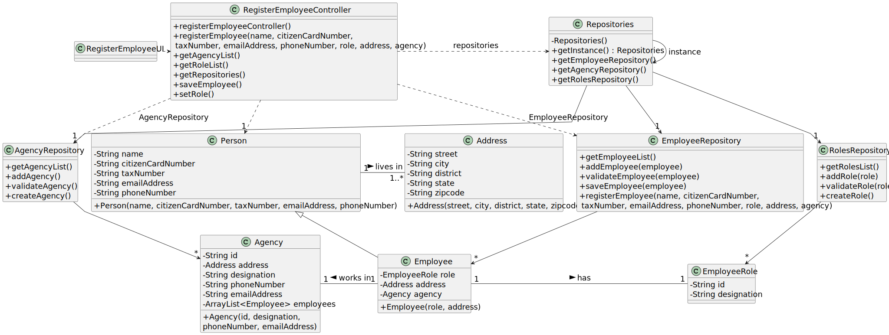

# US 003 - To register an employee

## 3. Design - User Story Realization 

### 3.1. Rationale

**SSD - Alternative 1 is adopted.**

| Interaction ID | Question: Which class is responsible for... | Answer               | Justification (with patterns)|
|:-------------  |:--------------------- |:---------------------|:--------------------------------------------------------------------------------------------------------------|
| Step 1: asks to register an employee	 |	... interacting with the actor? | RegisterEmployeeUI| Pure Fabrication|
| Step 2: requests date	 |...displaying the UI for the actor to input date?| RegisterEmployeeUI|    Pure Fabrication|
| Step 3: types requested date |...validating the date?  | RegisterEmployeeUI             |Pure Fabrication|
| Step 4: shows roles list and ask to select one|...displaying the employee role list| RegisterEmployeeUI| Pure Fabrication|
| |...obtaining the employee role list? | Role Repository|Information expert, Pure Fabrication |
| Step 5: selects an employee role 		 |...validating selected role|RegisterEmployeeUI|Pure Fabrication|
| Step 6: shows all date and requests confirmation |...displaying all the information before submitting?|RegisterEmployeeUI|Pure Fabrication|              
| Step 7: confirms date |	... validating all date (local validation)? |Employee|Information expert, the object created has its own date|
|         | ...adding to a collection and globally validating duplicated records?     |EmployeeRepository | Knows all its employee instances|
| Step 8: informs operation success		 |	... informing operation success?|RegisterEmployeeUI|Pure Fabrication| 

### Systematization ##

According to the taken rationale, the conceptual classes promoted to software classes are: 

 * EmployeeRepository
 * Employee
 * RoleRepository

Other software classes (i.e. Pure Fabrication) identified: 

 * RegisterEmployeeUI  
 * RegisterEmployeeController

## 3.2. Sequence Diagram (SD)

### Full Diagram

This diagram shows the full sequence of interactions between the classes involved in the realization of this user story.

## 3.3. Class Diagram (CD)

