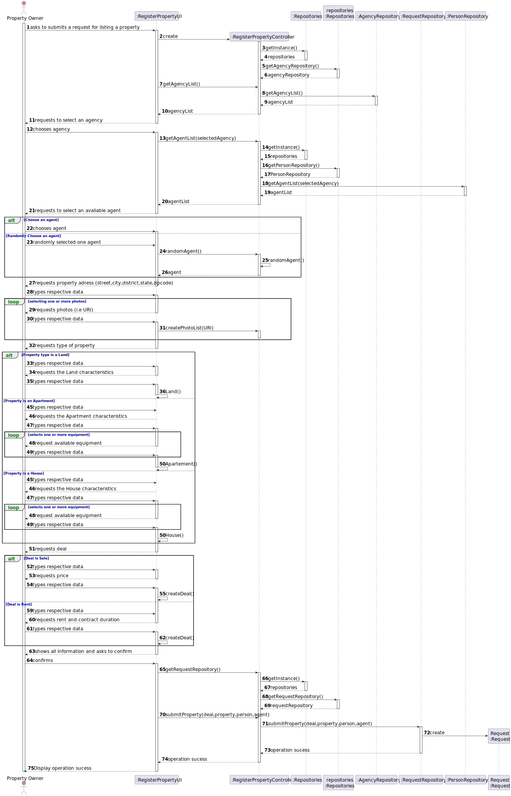
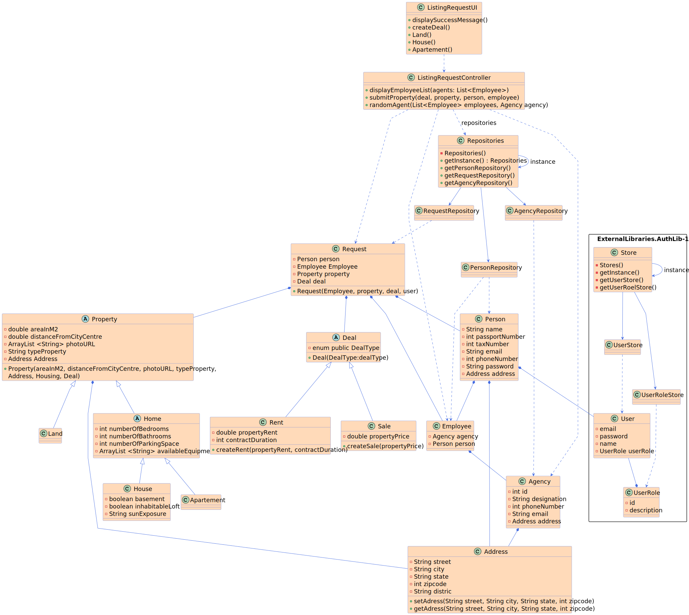

# US 004 - Create a request for listing a property

## 3. Design - User Story Realization 

### 3.1. Rationale

**SSD - Alternative 1 is adopted.**

| Interaction ID | Question: Which class is responsible for... | Answer| Justification (with patterns)|
|:-------------  |:--------------------- |:---------------------|:---------------------------------------------|
| Step 1: asks to listing a property  |	... interacting with the actor? | ListingRequestUI | Pure Fabrication: there is no reason to assign this responsibility to any existing class in the Domain Model. |
| 			  		 |	... instantiating a new Announcement? | User         | Creator (Rule 1): the user creates a new Announcement Request for their property.                                                         |
| 			  		 | ... knowing the user using the system?  | UserSession          | IE: cf. A&A component documentation.                                                                          |
|  		  		 |							 | repository         | IE: knows the UserRepository                                                                             |
| Step 2: shows the list of agents | ...coordinating the US?  | ListingRequestController | Controller |
| 	      |	...  has the agency list? | AgencyRepository | IE: knows and stores all agencies/ Pure Fabrication |
|         |... interacting with the actor? | ListingRequestUI | Pure Fabrication: there is no reason to assign this responsibility to any existing class in the Domain Model. |
| Step 3: chooses agency |	...select a Agency | ListingRequestUI | Pure Fabrication|
| Step 4: shows the list of agents available    | ...displays all agents | ListingRequestUI | Pure Fabrication|
|                        | ...gets all the agents | ListingRequestController | Controller|
| 	      |	...  has the agent list? | Repository | IE: knows and stores all agents/ Pure Fabrication |
| Step 5: chooses agent | ...showing the list with all of the agents| ListingRequestUI | Pure Fabrication |
| Step 6: requests property address | 	...saving the inputted date?| ListingRequestUI | Pure Fabrication |          
| Step 7: types respective date	| 	... validating all data (local validation)?| ListingRequestUI | Pure Fabrication| 
| Step 8: requests photos (i.e URL) | 	... where is going? | ListingRequestUI| Pure Fabrication|
| Step 10: requests type of property |...where is going? | ListingRequestUI | Pure Fabrication |
| Step 11: request the property characteristics (Land,Appartement,House) | ...where is going? | ListingRequestUI | Pure Fabrication|
| Step 18: request the deal type (Rent,Sale) | ...where is going? | ListingRequestUI | Pure Fabrication|
| Step 21: confirms the data | ...interacting with the actor? | ListingRequestUI | Pure Fabrication|
|          |...submit the request? | ListingRequestController | Controller |
|          |...saves all the requests? | AnnouncementRepository | Information Expert: owns its data. |
### Systematization ##

According to the taken rationale, the conceptual classes promoted to software classes are: 

 * Land
 * House
 * Appartement
 * Property
 * Deal
 * Announcement
 * Date

Other software classes (i.e. Pure Fabrication) identified: 

 * ListingRequestUI  
 * ListingRequestController
 * PersonRepository
 * AgencyRepository
 * AnnouncementRepository
 

## 3.2. Sequence Diagram (SD)

  

## Full Diagram

  

  

## 3.3. Class Diagram (CD)

  

