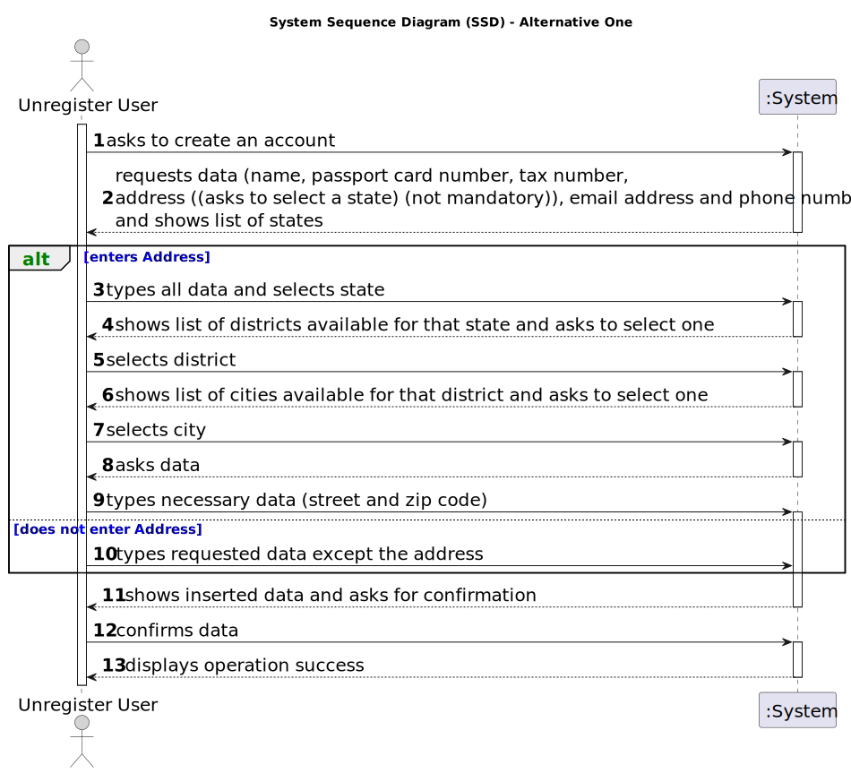

# US 007 - Register to buy, sell or rent properties

## 1. Requirements Engineering

### 1.1. User Story Description

> As an unregistered user, I want to register in the system to buy, sell or rent properties.

### 1.2. Customer Specifications and Clarifications 

**From the specifications document:**

>	When the client decides to buy/rent the property, he sends a request for the purchase/lease of the property to the agent.

>   Owners go to one of the company's branches and meet with a real estate agent to sell or rent one or more properties, or they can use the company's application for the same purposes.

> All those who wish to use the application must be authenticated with a password of seven alphanumeric characters, including three capital letters and two digits.

**From the client clarifications:**

>**Q**: ou said that the owner can choose a password, but how many letters, numbers... it needs to have?
>
>**A**: In the Project Description we get: "All those who wish to use the application must be authenticated with a password of seven alphanumeric characters, including three capital letters and two digits".
>
> [source](https://moodle.isep.ipp.pt/mod/forum/discuss.php?d=22519#p28509)
* * *

>**Q**: When an unregistered user wants to register a new account in the system, the set of parameters that are asked are the following: name, citizen card number, tax number, email, phone number, and password. Do you want any extra parameters/requirements to be asked or just the ones specified above? If so, which ones are mandatory?
>
>**A**: The Owner attributes are: the name, the citizen's card number, the tax number, the address, the email address and the contact telephone number. The address of the owner is not mandatory.
>
> [source](https://moodle.isep.ipp.pt/mod/forum/discuss.php?d=22376#p28373)
* * *

>**Q**: Does the user also receive the password via email or can he choose a password when registering?
>
>**A**: The owner can choose a password when registering.

>
> [source](https://moodle.isep.ipp.pt/mod/forum/discuss.php?d=22374#p28371)
* * *

>**Q**: It was previously stated that an unregistered user could do a property listing request. However, with the introduction of US007, I want to clarify and make sure that now a user needs to be registered in order to buy, sell or rent properties, or if they can still do it unregistered.
>
>**A**: In Sprint B we introduce US7 and now, in US4, the owner needs to be registered in the system to submit a request for listing. You should update all artifacts to include this change.

>
> [source](https://moodle.isep.ipp.pt/mod/forum/discuss.php?d=22430#p28365)
* * *

>**Q**: It was previously stated that an unregistered user could do a property listing request. However, with the introduction of US007, I want to clarify and make sure that now a user needs to be registered in order to buy, sell or rent properties, or if they can still do it unregistered.
>
>**A**: In Sprint B we introduce US7 and now, in US4, the owner needs to be registered in the system to submit a request for listing. You should update all artifacts to include this change.

>
> [source](https://moodle.isep.ipp.pt/mod/forum/discuss.php?d=22430#p28365)
* * *
### 1.3. Acceptance Criteria

* **AC1:** authentication with password of seven alphanumeric characters, including three capital letters and two digits
* **AC2:** The address of the owner is not mandatory.
* **AC3:** The user can choose a password when registering.

### 1.4. Found out Dependencies

* This US have one dependecies

### 1.5 Input and Output Data

**Input Data:**

* Typed date:
	* a name, 
	* a passport card number, 
	* a tax number, 
	* an address (not mandatory),
	* an email,
	* a phone number

**Output Data:**

* shows all the user's info
* (In)Success of the operation

### 1.6. System Sequence Diagram (SSD)

**Other alternatives might exist.**

#### Alternative One

