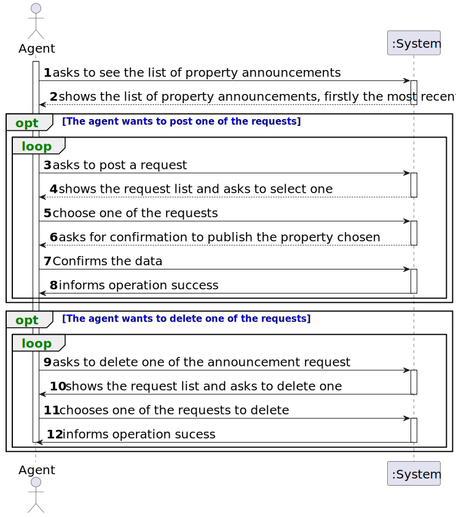

# US 008 - See the list of property announcement requests and post an announcement

## 1. Requirements Engineering

### 1.1. User Story Description

> As an agent, I intend to see the list of property announcement requests made
to myself, so that I can post the announcement.

### 1.2. Customer Specifications and Clarifications 

**From the specifications document:**

>	When the client decides to buy/rent the property, he sends a request for the purchase/lease of the
property to the agent. After being appreciated by the agent, he accepts or rejects the order. If the
request is accepted, the offer will not be shown again to clients using the application.

**From the client clarifications:**

>**Q**:  About US08, since as an agent I intend to see the advertisement requests made to me in order to publish the chosen advertisement after consulting the list, why should there be an option to reject it since the previously chosen advertisement had already the intention of being published.The rejection operation shouldn't be described as another feature?
>
>**A**: I want to check all property announcement requests and have the option to accept or reject any announcement request. The property owner is a human being and can make errors like any other human being...
>
> [source](https://moodle.isep.ipp.pt/mod/forum/discuss.php?d=23148#p29301)
* * *

>**Q**: besides the creation of a message justifiyng the rejection should a message or an email be sent to the client.
>
>**A**: The system should also send the message to the owner by e-mail.
> 
> [source](https://moodle.isep.ipp.pt/mod/forum/discuss.php?d=23136#p29299)
* * *

>**Q**: Does the request once its declined by the agent be deleted from the request list?
>
>**A**: The announce request should not be shown again to the agent. We never delete information from our system.
>
> [source](https://moodle.isep.ipp.pt/mod/forum/discuss.php?d=23134#p29298)
* * *

>**Q**: Do the agent have to insert the commission after accepting the request from the request list?
>
>**A**: The agent should, firstly, set the commission and then publishes the offer in the system. The sale price (the USD value that is shown in the announcement) should include the commission value (owner requested price + commission) and should not show the commission. The commission is only specified when the agent accepts the request.
>
> [source](https://moodle.isep.ipp.pt/mod/forum/discuss.php?d=23127#p29296)
* * *

>**Q**: Is the owner responsible to assigning the property to an agent or there are other ways to do that?
>
>**A**: In US8 we get "As an agent, I intend to see the list of property announcement requests made to myself, so that I can post the announcement". In this US the agent is the actor.
>
> [source](https://moodle.isep.ipp.pt/mod/forum/discuss.php?d=23054#p29202)
* * *

>**Q**: Regarding US008, can the agent decline an announcement request?
> 
> **A** :Yes. The agent must include a message justifying the rejection.
> 
> [source](https://moodle.isep.ipp.pt/mod/forum/discuss.php?d=22940#p29046)
* * *

>**Q**: Can the agent select multiple requests at the same time?
> 
> **A**:  No. The agent can only post one announcement at a time.
> 
> [source](https://moodle.isep.ipp.pt/mod/forum/discuss.php?d=22875#p29038)
* * *

>**Q**: When displaying the property announcement requests in the system to the agent besides them being ordered from most recent to oldest is there a need to display the specific day where the requests were published?
> 
> **A**: The list of property announcement requests should be sorted by the date they were created, with the most recent requests appearing first. The system should show the date when the property announcement requests was made.
>
> [source](https://moodle.isep.ipp.pt/mod/forum/discuss.php?d=22871)
* * *

>**Q**: Does the customer have any say in setting the commission (agree or deny, eg: commission too high so I withdraw the ad request) or is the commission solely set by the agent without customer approval?
> 
> **A**: The agent should, firstly, set the commission and then publishes the offer in the system. The sale price (the USD value that is shown in the announcement) should include the commission value (owner requested price + commission) and should not show the commission. The commission is only specified when the agent accepts the request.
> 
> [source](https://moodle.isep.ipp.pt/mod/forum/discuss.php?d=23062#p29292)
* * *

>**Q**:In this US8, will it be necessary to show search criteria? If so, which ones?
> 
> **A**:There is no search criteria.
> 
> [source](https://moodle.isep.ipp.pt/mod/forum/discuss.php?d=22954#p29129)
* * *

### 1.3. Acceptance Criteria

* **AC1:** The list of property announcement requests should be sorted by the date
  they were created, with the most recent requests appearing first.
* **AC2:** An announcement is posted when a request is accepted. The list of requests
  should be refreshed, and that request should not be shown again.

### 1.4. Found out Dependencies

* There must have already a list of property announcements 

### 1.5 Input and Output Data

**Input Data:**

* Typed date:
    * The agent responsible
    * The list of property announcement requests

* Selected data:
  * The list of announcement requests 
  * The agent set as responsible for the listing of the property to sale/rent.
   
**Output Data:**
* The post of one of the announcements on the list onto the system.
### 1.6. System Sequence Diagram (SSD)

**Other alternatives might exist.**

#### Alternative One

