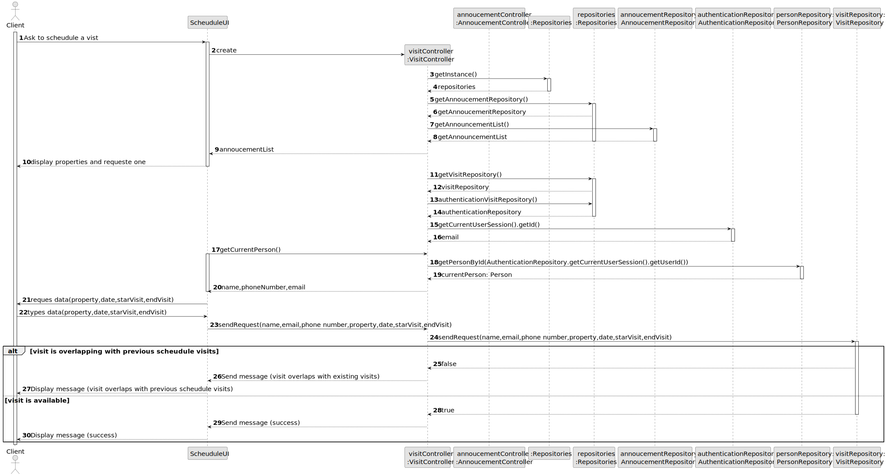
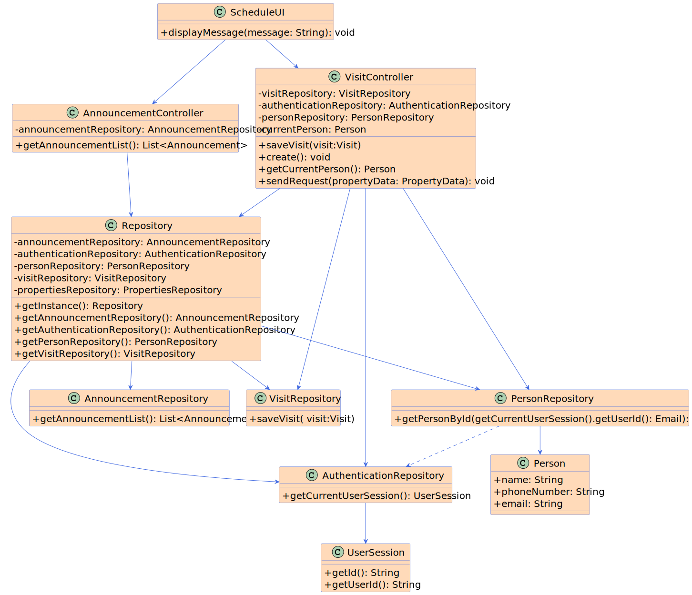

# US 009 - Publish announcement 

## 3. Design - User Story Realization 

### 3.1. Rationale

**SSD - Alternative 1 is adopted.**

| Interaction ID                                    | Question: Which class is responsible for...              | Answer                    | Justification (with patterns)                                                                                                                                                                                                                                                                                     |
|:--------------------------------------------------|:---------------------------------------------------------|:--------------------------|:------------------------------------------------------------------------------------------------------------------------------------------------------------------------------------------------------------------------------------------------------------------------------------------------------------------|
| Step 5 - sends announcement list                  |..sending the announcement list to UI?                          | VisitController               | Controller                                                                                                                                                                                                                           |
| Step 8 - retrieves authentication repository      | 			..retrieving the authentication repository?                        | VisitController               | Controller                                                                                                                                                                                                                 |
| Step 11 - retrieves current person's details	     | 	.  ...retrieving the current person's details?              | PersonRepository             | Controller: GUIController class handles the interaction between the GUI and other components for file selection.                                                                                                                                                                                                  |
| Step 16 - sends visit request to VisitRepository	 | 	            ..sending the visit request to VisitRepository?| VisitController          | Controller                                                                                                                                                                                                                              |
| Step 17 - checks if visit overlaps                | 	          .checking if the visit overlaps with previous scheduled visits?             |                    VisitRepository       |Information Expert: The VisitRepository has the necessary information to determine if the visit overlaps.                                                                                                           |
| Step 19 - sends message to UI	                    |                                sending the message (visit overlap) to UI?                          | VisitController | Controller                                                                                                                                                                              |              
|                                                   | 	   sending the response (visit availability) to UI?          |               VisitRepository            |     Controller                                                  | 
| 	                                                 | 	..sending the success message to UI?	         | VisitController              |   Controller                                                                    | 

### Systematization ##

According to the taken rationale, the conceptual classes promoted to software classes are: 

 * Visit

Other software classes (i.e. Pure Fabrication) identified: 

 * ScheduleUI

## 3.2. Sequence Diagram (SD)

### Alternative 1 - Full Diagram

This diagram shows the full sequence of interactions between the classes involved in the realization of this user story.

## 3.3. Class Diagram (CD)

