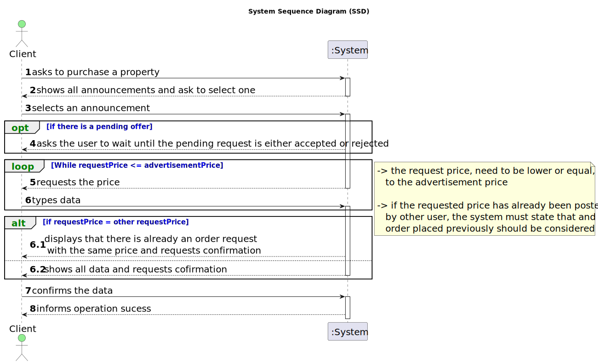

# US 010 - Place an order to purchase the property

## 1. Requirements Engineering

### 1.1. User Story Description

> As a client, I place an order to purchase the property, submitting the order amount. 

### 1.2. Customer Specifications and Clarifications 

**From the specifications document:**

>	When the client decides to buy/rent the property, he sends a request for the purchase/lease of the property to the agent.

**From the client clarifications:**

>**Q**: Should this User Story be implemented as an addition to US001 (Users can display properties, and select one to make an order), or should it be completely separate, with a separate section of the app dedicated to it?
>
>**A**: To place an order the actor should be registered in the system.
>
> [source](https://moodle.isep.ipp.pt/mod/forum/discuss.php?d=22853#p28967)
* * *
>**Q**: In US10, can the client remove an offer they made at any point, in order to replace it with a different one?
>
>**A**: No.
>
> [source](https://moodle.isep.ipp.pt/mod/forum/discuss.php?d=22845#p28960)
* * *
>**Q**: When the client intends to place a purchase order, should the list of properties (announcements) be presented initially and then asked to select a property?
>
>**A**: The system should show a list of properties to the client.
>
> [source](https://moodle.isep.ipp.pt/mod/forum/discuss.php?d=22840#p28958)
* * *
>**Q**: What date is required, in addition to the order value, so that a client can place an order to purchase a property?
>
>**A**: Only the order amount.
>
> [source](https://moodle.isep.ipp.pt/mod/forum/discuss.php?d=22810#p28912)
* * *

### 1.3. Acceptance Criteria

* **AC1:** The order amount submitted by the client must be equal to or lower than the price set by the owner for the property. 
* **AC2:**  If the order amount submitted by the client has already been posted for the property (by another request from this client or any other client), the system must state that on the screen and the order placed previously should be considered first when selling the property. 
* **AC3:** A client can only submit a new order to purchase the same property after the previous one is declined. 

### 1.4. Found out Dependencies

* There is a dependency to "US007 register an unregistered user", since the client need to be registered in the system.

### 1.5 Input and Output Data

**Input Data:**

* Typed date:
	* requested price 

**Output Data:**

* displays that there is already an order request with the same price
* shows all the user's info
* (In)Success of the operation

### 1.6. System Sequence Diagram (SSD)

**Other alternatives might exist.**

#### Alternative One

