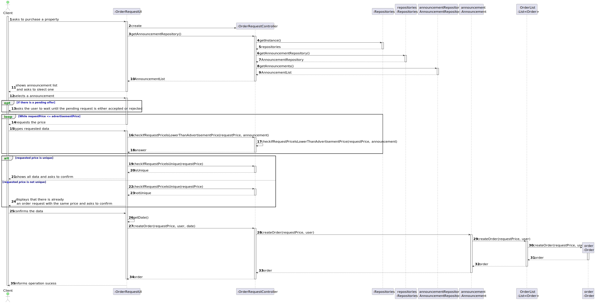
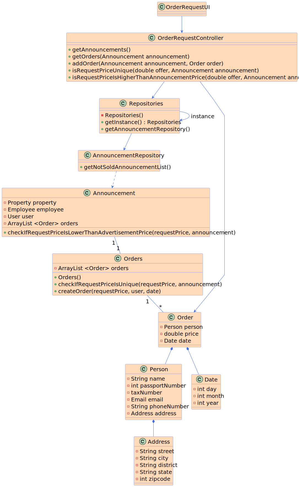

# US 010 - Place an order to purchase the property

## 3. Design - User Story Realization 

### 3.1. Rationale

**SSD - Alternative 1 is adopted.**

| Interaction ID | Question: Which class is responsible for... | Answer               | Justification (with patterns)                                                                                 |
|:-------------  |:--------------------- |:---------------------|:--------------------------------------------------------------------------------------------------------------|
| Step 1 - asks to purchase a property 		 |	... interacting with the actor? | OrderRequestUI         | Pure Fabrication: there is no reason to assign this responsibility to any existing class in the Domain Model. |
| 		 |	... gets all the announcements? | OrderRequestController | Controller |
| 		 |	... where are all the announcements? | AnnouncementsRepository | Pure Fabrication: there is no reason to assign this responsibility to any existing class in the Domain Model. |
| Step 2 - shows all announcements  |	...interacting with the actor? | OrderRequestUI | Pure Fabrication: there is no reason to assign this responsibility to any existing class in the Domain Model. |
| Step 3 - selects an announcement 		 |	...interacting with the actor? | OrderRequestUI | Pure Fabrication: there is no reason to assign this responsibility to any existing class in the Domain Model. |
| Step 4 - requests the price 		 |	...interacting with the actor?| OrderRequestUI | Pure Fabrication: there is no reason to assign this responsibility to any existing class in the Domain Model. |
| Step 5 - types data		 |	...interacting with the actor?| OrderRequestUI | Pure Fabrication: there is no reason to assign this responsibility to any existing class in the Domain Model. |
|  |	...check If Request Price Is Lower Than Advertisement Price? | OrderRequestController | Controller |
| Step 6.1 - displays that there is already an order with the same price 		 |	...interacting with the actor?|OrderRequestUI|Pure Fabrication: there is no reason to assign this responsibility to any existing class in the Domain Model. |	
| |...check If Request Price Is Unique? | OrderRequestController | Controller |OrderRequestUI | Pure Fabrication: there is no reason to assign this responsibility to any existing class in the Domain Model. |
| Step 6.2 - shows the same price and requests confirmation 		 |	...interacting with the actor?| OrderRequestUI | Pure Fabrication: there is no reason to assign this responsibility to any existing class in the Domain Model. |
| Step 8 - confirms the data		 |	...interacting with the actor?| OrderRequestUI | Pure Fabrication: there is no reason to assign this responsibility to any existing class in the Domain Model. |
| 		 |	...generate the current date?| OrderRequestUI | Pure Fabrication: there is no reason to assign this responsibility to any existing class in the Domain Model. |
| 		 |	...create an order?| OrderRequestController | Controller |
| 		 |	...where is stored the list of orders?| Announcement | IE: knows all the orders that are associated with the announcement |
| 		 |	...where the order go?| Orders | IE: List of all orders of a specific announcement |
| Step 9 - informs operation sucess 		 |	... informing operation sucess | OrderRequestUI | IE: is responsible for user interactions. |

### Systematization ##

According to the taken rationale, the conceptual classes promoted to software classes are: 

 * Announcement
 * Orders
 * Order

Other software classes (i.e. Pure Fabrication) identified: 

 * OrderRequestUI  
 * OrderRequestController
 * AnnouncementRepository

## 3.2. Sequence Diagram (SD)

This diagram shows the full sequence of interactions between the classes involved in the realization of this user story.

## 3.3. Class Diagram (CD)

