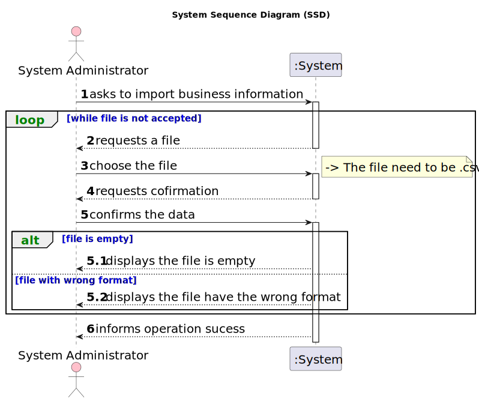

# US 012 - Import information from a legacy system

## 1. Requirements Engineering

### 1.1. User Story Description

> As a system administrator, I want to import information from a legacy system that has been in use in several agencies. 

### 1.2. Customer Specifications and Clarifications 

**From the specifications document:**

>	The application to be developed in this project will replace an application that was already in operation in some agencies and will be replaced in July 2023. 

**From the client clarifications:**

>**Q**: In the project description and the previous US's it is stated that the area (and distance from the city center) of a property must be in meters (or m^2), however in the legacy file the measuring system used in the area is feet (the distance is also in miles) instead. As such, do we need to convert the data into meters when we are importing the file information or do we just import the data and pretend it is in meters for the purposes of the application?
>
>**A**: There is no need to convert the area and distances metrics. Both in the legacy system and in the system that we are developing now, the area should always be measured in feet and the distance in miles.
>
> [source](https://moodle.isep.ipp.pt/mod/forum/discuss.php?d=23446#p29667)
* * *
>**Q**: Are we only expected to read address with those formats or will there be address with other formats?
>
>**A**: You should only consider address formats that can be seen in the two CSV files that were made available in moodle.
>
>**Q**: Some address are registered with the State  AK, is that a mistake and the State should really be Alaska (AK) or is that intended
>
>**A**: All data must be correct and no errors have been deliberately introduced. I checked the file and I only get State AK. Maybe your are opening the CSV file using an application that uses a character encoding that is different from utf-8.
>
> [source](https://moodle.isep.ipp.pt/mod/forum/discuss.php?d=23391#p29639)
* * *
>**Q**: In the US012 (import information from a legacy system) we need to import some properties, however, as you said previously when creating a property the client account associated must exist therefore when importing the files we also create the client account however some client email have aphostrofes making them impossible to be registed due to the authentication methods that we were given. It's also important to state that we can not change them.Therefore my question is how should we proceed when facing with an email that has an aphostrofe, should we ignore the property?
>
>**A**: I just checked the CSV files and I can not see the problem you are reporting. Can you give me an example?
>
> [source](https://moodle.isep.ipp.pt/mod/forum/discuss.php?d=23390#p29636)
* * *
>**Q**: The stores that are given in the .csv file still exist? If so we need to add it to the store repository of the new program and treat them as regular stores like the ones add it in Us005? Or is just information to keep I’m other repositories.
>
>**A**: I am the client and I am not an expert in Software Engineering. Please discuss this issue with your ESOFT teachers.

>
> [source](https://moodle.isep.ipp.pt/mod/forum/discuss.php?d=23389#p29635)
* * *
>**Q**: From the provided CSV file, our team infers that this feature is meant to import data related to announcements only and not other data like, for example, employee information. Is this correct?
>
>**A**: The new system should allow the System Admininstrator to import CSV files like the one provided in moodle. The legacy system is not able to export any other fields/attributes or formats.
>**Q**:Also, in relation to AC2, can we assume that a CSV file is any file whose filename ends with ".csv"?
>
>**A**:The System Administrator should be able to load any file with the extension csv. The file content must be validated, showing a message to the system administrator if the file is empty or its content is not in the requested format.
>
> [source](https://moodle.isep.ipp.pt/mod/forum/discuss.php?d=22943#p29048)
* * *
>**Q**: In the legacy File provided, on the Location, I assume that the structure of the cell is: Address, City, State, and postal code. Assuming that this is the right structure, shouldn't the districts of the cities be there as well?
>
>**A**: Please check carefully the legacy file. For instance, in line 5 we get "71 ST. NICHOLAS DRIVE, NORTH POLE, FAIRBANKS NORTH STAR,  AK, 99705". When loading the data, you should consider location addresses with and without district info.
>
> [source](https://moodle.isep.ipp.pt/mod/forum/discuss.php?d=22950#p29047)
* * *
>**Q**: It has been clearly previously established that there are two types of commissions (fixed and percentage). However, the CSV containing the data from the legacy system only has one column that references any type of commission: column U "commission(%)". Does that mean that there is only one type of commission, or was the fixed type accidentally left out or did I fail to notice the fixed commission type?
>
>**A**: In the past our company only had the type of commissions that you see in the CSV file. Our legacy system has many limitations and this is why we are asking you to develop a new system.

>
> [source](https://moodle.isep.ipp.pt/mod/forum/discuss.php?d=22851#p28965)
* * *
>**Q**: In the CSV containing the data from the legacy system, properties classified as Apartment have themselves a value for Sun Exposure. However, the specification document describes this attribute as exclusive to the property type House: "In case the property is a house, the existence of a basement, an inhabitable loft, and sun exposure must be registered as well.". Do we add Sun Exposure to the apartment's attributes or does it stay exclusive to house?
>
>**A**: When loading an apartment from the leagacy system (from the CSV file) you should ignore the attribute Sun Exposure.The CSV file contains data exported from a legacy system. The legacy system does not registers the same information that the system that you are developing now registers. For instance, the legacy system does not associates an agent to a property, therefore, when importing data from a legacy system you should create a agent/employee having:name=Legacy Agent; passport card number=000000000; tax number=000000000, email address=legacy@realstateUSA.com; contact telephone number = 0000000000; and associate this "legacy agent" with each property (make it the property responsable agent). Moreover, you should prepare your system to accept two formats for the passport number, one with 9 numbers and the other starts with the letter C followed by eight numbers.
>
> [source](https://moodle.isep.ipp.pt/mod/forum/discuss.php?d=22849#p28964)
* * *
>**Q**: Can the System Administrator, when wanting to import information from a legacy system, send more than one file at once?
>
>**A**: Only one file at a time.
>
> [source](https://moodle.isep.ipp.pt/mod/forum/discuss.php?d=22843#p28914)
* * *

### 1.3. Acceptance Criteria

* **AC1:** The system administrator must be able to choose a file to import.  
* **AC2:** The system should only accept CSV files. 
* **AC3:** The file content must be validated, showing a message to the system administrator if the file is empty or its content is not in the requested format. 
* **AC4:**  The import operation, when successful, should trigger a success message to the system administrator. 

### 1.4. Found out Dependencies

* There are no dependencies in this US.

### 1.5 Input and Output Data

**Input Data:**

* Input files:
	* csv file 

**Output Data:**

* displays the file is not accepted
* (In)Success of the operation

### 1.6. System Sequence Diagram (SSD)

