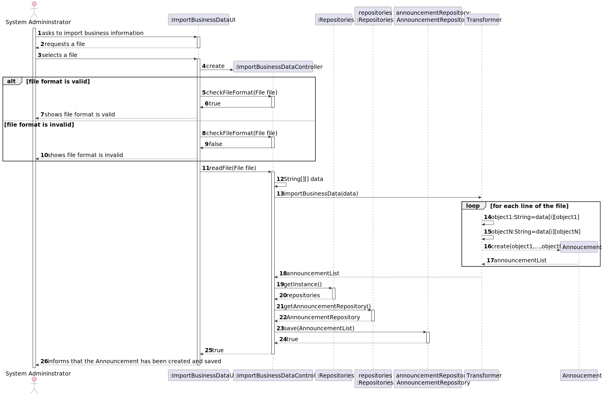
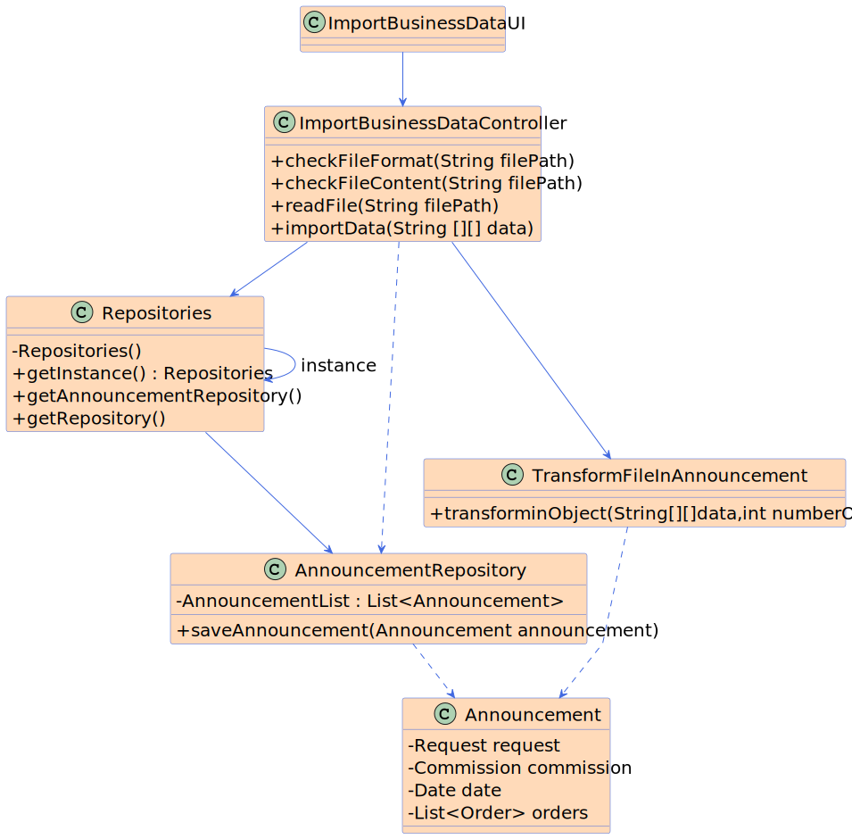

# US 012 - Import information from a legacy system

## 3. Design - User Story Realization 

### 3.1. Rationale

Here is a table summarizing the responsibilities based on the provided diagram:

| Interaction ID | Question: Which class is responsible for... | Answer               | Justification (with patterns)                                                                                 |
|:-------------  |:--------------------- |:---------------------|:--------------------------------------------------------------------------------------------------------------|
| Step 1 - asks to import business information |	...interacting with the actor? | ImportBusinessDataUI | Pure Fabrication: There is no reason to assign this responsibility to any existing class in the Domain Model. |
| Step 2 - requests a file |	...interacting with the actor? | ImportBusinessDataUI | Pure Fabrication: There is no reason to assign this responsibility to any existing class in the Domain Model. |
| Step 3 - selects a file |	...interacting with the actor? | ImportBusinessDataUI | Pure Fabrication: There is no reason to assign this responsibility to any existing class in the Domain Model. |
| Step 4 - check file format |	...interacting with the actor? | ImportBusinessDataController | Controller |
| Step 5.1 - shows file format is valid |	...interacting with the actor? | ImportBusinessDataUI | Pure Fabrication: There is no reason to assign this responsibility to any existing class in the Domain Model. |
| Step 5.2 - shows file format is invalid |	...interacting with the actor? | ImportBusinessDataUI | Pure Fabrication: There is no reason to assign this responsibility to any existing class in the Domain Model. |
| Step 6 - read file |	...interacting with the actor? | ImportBusinessDataController | Controller |
| Step 7 - import business data |	...transforming and importing data? | Transformer | Transformer/Importer: The responsibility of transforming and importing business data is typically handled by a separate transformer or importer class. |
|  |	...create announcements? | Announcement | Creator/Factory Method: The responsibility of creating announcements is typically handled by a separate announcement class or a creator/factory method. |
|  |	...save announcements? | AnnouncementRepository | Repository Pattern: The responsibility of saving announcements to a repository is typically handled by an announcement repository class. |
| Step 8 - save announcements |	...interacting with the repository? | AnnouncementRepository | Repository Pattern: The responsibility of saving announcements to a repository is handled by the announcement repository class. |
|  |	...inform that the announcements have been created and saved? | ImportBusinessDataUI | Pure Fabrication: There is no reason to assign this responsibility to any existing class in the Domain Model. |

### Systematization ##

According to the taken rationale, the conceptual classes promoted to software classes are: 

 * Organization
 * Task

Other software classes (i.e. Pure Fabrication) identified: 

 * ImportBusinessDataUI  
 * ImportBusinessDataController

## 3.2. Sequence Diagram (SD)

### Alternative 1 - Full Diagram

This diagram shows the full sequence of interactions between the classes involved in the realization of this user story.

## 3.3. Class Diagram (CD)

