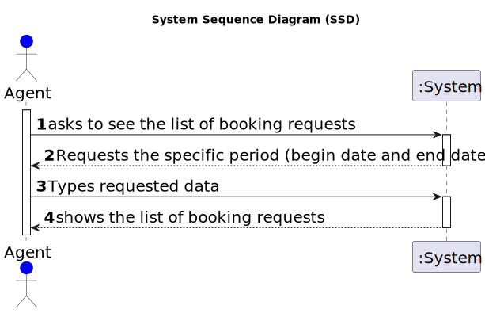

# US15: List all booking requests for properties managed by an Agent

## 1. Requirements Engineering

### 1.1. User Story Description

> US15: As an agent, I intend to list all booking requests for properties managed by
me.

### 1.2. Customer Specifications and Clarifications 

**From the specifications document:**

>	After consulting a list of properties, the client can request to schedule a visit to the real estate agent
for a specific property to verify its conditions.

**From the client clarifications:**

>**Q**: In US015's AC1, it is stated that "The list of requests must be shown for a specific period (begin date, end date)."
This time period caused confusion, as the team is unsure whether the "date" is referring to the date chosen by the client in the message (See US009's requirements) or the date of creation of the visit request. 
> 
>**A**: The goal is to use the date chosen by the client (the preferred date that you can see in US9) to list booking requests.
> 
> [source](https://moodle.isep.ipp.pt/mod/forum/discuss.php?d=23362#p29628)
* * *

>**Q**: US015's AC1 states that "The list of requests must be shown for a specific period (begin date, end date)". As such, our team would like to know if you want this time period to be selected or typed, and in which format it should be in.
> 
> **A**: The dates should be selected. The format should be DD-MM-YYYY.
> [source](https://moodle.isep.ipp.pt/mod/forum/discuss.php?d=23338#p29618)
* * *
>**Q**: Booking is a slightly vague word. Our team wants clarifications on what type of requests the word encompasses (visit requests being our strongest guess, but we are not sure).
> 
> **A**: It is a visit request.
> [source](https://moodle.isep.ipp.pt/mod/forum/discuss.php?d=23316#p29615)
* * *
>**Q**:One of our questions' answers made us believe there might have been some miscommunication, as it had some significant mistakes in phrasing and your answer wasn't clear enough. As such, here is that same question, in a simpler and clearer way:
US017's AC2 states that "Two sorting algorithms should be implemented (to be chosen manually by the network manager)."
US015's AC2 states that "The list of requests must be sorted by date in ascending order. The sorting algorithm to be used by the application must be defined through a configuration file. At least two sorting algorithms should be available."
As such, the team would like to know if, just like in US017, the sorting methods would be chosen manually in US015.
> 
> **A** :  In US 15 the sorting algorithm to be used by the application must be defined through a configuration file. This is a diferent strategy from what I want in US17. Please study ESOFT.
> [source](https://moodle.isep.ipp.pt/mod/forum/discuss.php?d=23460)
* * *

### 1.3. Acceptance Criteria

* **AC1:** The list of requests must be shown for a specific period (begin date, end date).
* **AC2:** The list of requests must be sorted by date in ascending order. The sorting algorithm to be used by the application must be defined through a configuration file. At least two sorting algorithms should be available.

### 1.4. Found out Dependencies

* There must be a list of booking requests already
* There must be properties managed by a specific agent

### 1.5 Input and Output Data

**Input Data:**

* Start date
* End Date

**Output Data:**

* Booking request List 

### 1.6. System Sequence Diagram (SSD)

**Other alternatives might exist.**

#### Alternative One

