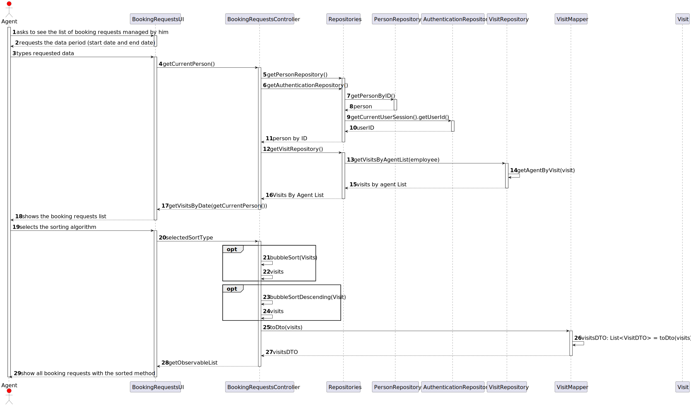
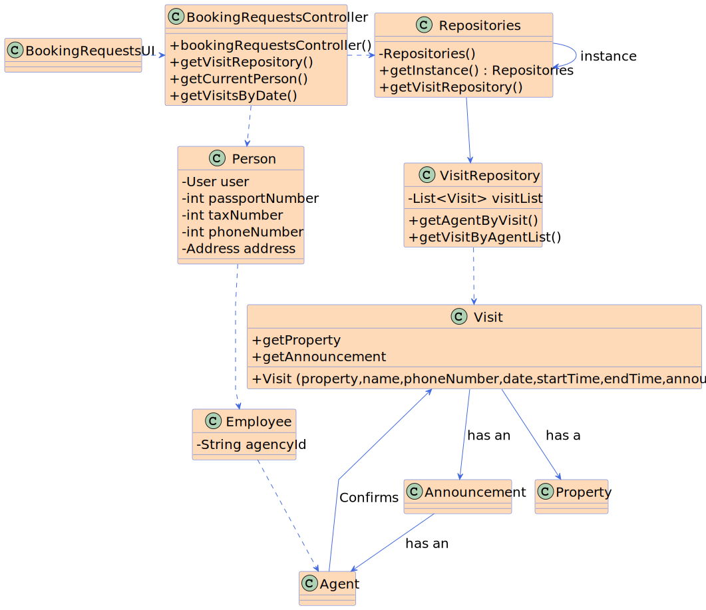

# US15: List all booking requests for properties managed by an Agent

## 3. Design - User Story Realization 

### 3.1. Rationale

**SSD - Alternative 1 is adopted.**

| Interaction ID | Question: Which class is responsible for... | Answer               | Justification (with patterns)                                                                                 |
|:-------------  |:--------------------- |:---------------------|:--------------------------------------------------------------------------------------------------------------|
| Step 1 : asks to see the list of booking requests   		 |	... interacting with the actor? | BookingRequestsUI | Pure Fabrication: there is no reason to assign this responsibility to any existing class in the Domain Model. |
| 			  		 |	... coordinating the US? | BookingRequestsController | Controller                                                                                                    |
| Step 2 : shows the list of booking requests | ...showing the list of booking requests?|BookingRequestsUI|     Pure Fabrication                                                                                                          |
| |... who is going to get the employee responsible for the booking requests? | AuthenticationRepository| | 
| |... who has all the booking requests?|VisitRepository| |
| |... who is getting all the booking requests for the respective Agent| VisitRepository| |
|Step 3 : Selects the sorting algorithm  | ... who is responsible to show the algorithms |BookingRequestsUI | |
| |... who has the algorithms  | BookingRequestsController| |

### Systematization ##

According to the taken rationale, the conceptual classes promoted to software classes are: 

 * AuthenticationRepository
 * VisitRepository 

Other software classes (i.e. Pure Fabrication) identified: 

 * BookingRequestsUI  
 * BookingRequestsController

## 3.2. Sequence Diagram (SD)

### Alternative 1 - Full Diagram

This diagram shows the full sequence of interactions between the classes involved in the realization of this user story.

## 3.3. Class Diagram (CD)

