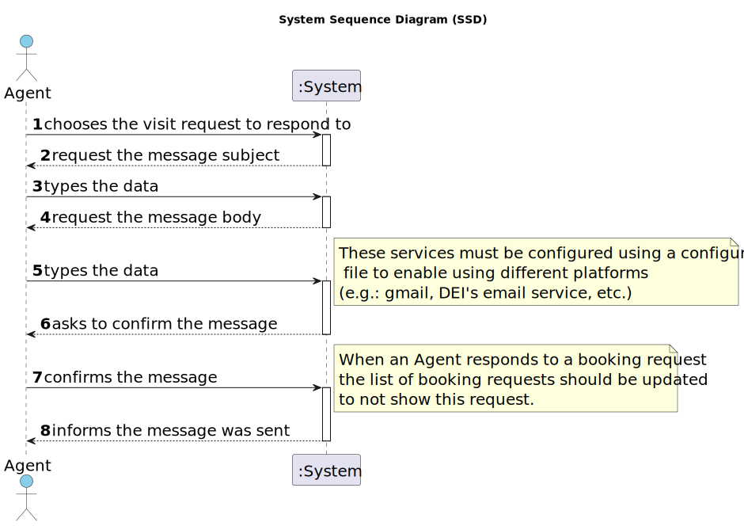

# US 016 - I want to respond to the user that scheduled the visit

## 1. Requirements Engineering

### 1.1. User Story Description

>  As an agent, when viewing a booking request, I want to respond to the user that scheduled the visit.  

### 1.2. Customer Specifications and Clarifications 

**From the specifications document:**

>	The agent receives the request, checks the availability and sends the response. If the customer accepts the order, it is automatically scheduled in the system. 

**From the client clarifications:**

>**Q**: Our team is having trouble understanding US016's AC2. Until now, the email has been sent in the form of a text file, however, with this AC, a configuration file that allows the use of different platforms has been introduced. How should the sending of emails be carried out then?
>
>**A**: The configuration file defines the email service to be used. The URI of the email service should be defined in the configuration file. The URI can be the path of a file. Please discuss this question with your ESOFT teatchers.
>
> [source](https://moodle.isep.ipp.pt/mod/forum/discuss.php?d=23365#p29629)
* * *
>**Q**: When the agent is responding to the user that created the request, what should the answer be? Because accepting or declining the request is already done in US011.
>
>**A**: In US11 the agent wants to accept or decline a purchase order for a property. In US16 the agent wants to answer visit requests. Please discuss the requirements with your team and professors before making a question.
>
> [source](https://moodle.isep.ipp.pt/mod/forum/discuss.php?d=23354#p29622)
* * *
>**Q**: In AC2, what is DEI's email service? Are you referring to Outlook?
>
>**A**: Different email services can send the message. These services must be configured using a configuration file to enable using different platforms (e.g.: gmail, DEI's email service, etc.). DEI email service is an email service like gmail or Outllook. These are only examples and you should prepare your system to support any email service.
>
> [source](https://moodle.isep.ipp.pt/mod/forum/discuss.php?d=23316#p29615)
* * *

### 1.3. Acceptance Criteria

* **AC1:** The response is sent by email.
* **AC2:** Different email services can send the message. These services must be configured using a configuration file to enable using different platforms (e.g.: gmail, DEI's email service, etc.) 
* **AC3:** The response should include the name and phone number of the responsible Agent. 
* **AC4:** The response should include the property identification and location. 
* **AC5:** When an Agent responds to a booking request the list of booking requests should be updated to not show this request. 

### 1.4. Found out Dependencies

* There is a dependency to "US015 - list all booking requests", since the agent needs to be able to see the booking requests in order to respond to them.
* There is a dependency to ""US009 - client schedule a visit",
since the agent need to a have at least one booking request to respond to it.

### 1.5 Input and Output Data

**Input Data:**

* Typed date:
	* chosen client
	* message body
	* subject

**Output Data:**

* (In)Success of the operation

### 1.6. System Sequence Diagram (SSD)

#### Alternative One

