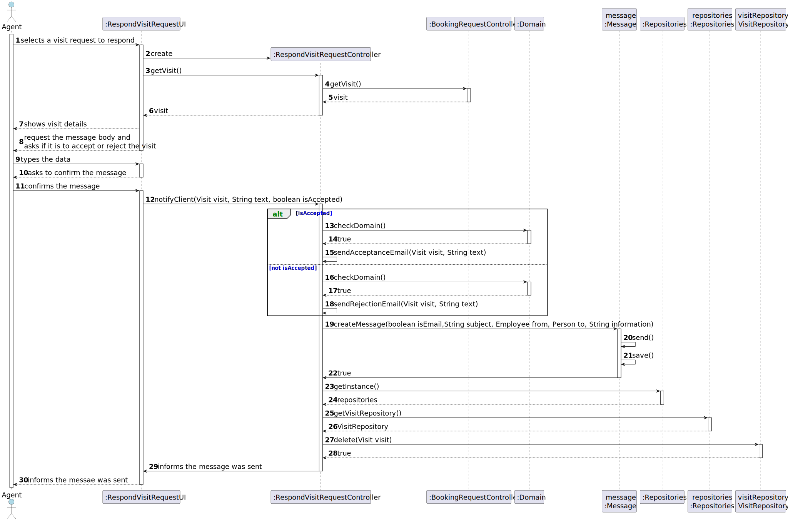
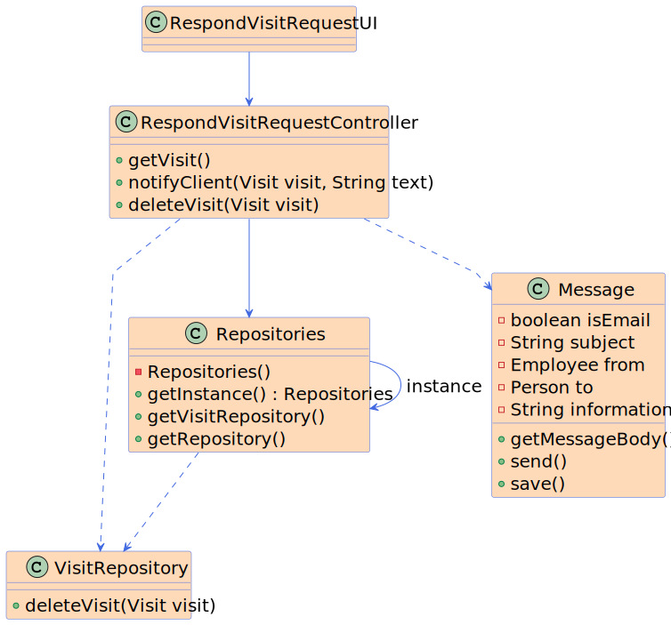

# US 016 - I want to respond to the user that scheduled the visit

## 3. Design - User Story Realization 

### 3.1. Rationale

**SSD - Alternative 1 is adopted.**

| Interaction ID | Question: Which class is responsible for... | Answer               | Justification (with patterns)                                                                                 |
|:-------------  |:--------------------- |:---------------------|:--------------------------------------------------------------------------------------------------------------|
| Step 1 - selects a visit request to respond |	...interacting with the actor? | RespondVisitRequestUI | Pure Fabrication: There is no reason to assign this responsibility to any existing class in the Domain Model. |
| Step 2 - get visit details |	...interacting with the actor? | RespondVisitRequestUI | Pure Fabrication: There is no reason to assign this responsibility to any existing class in the Domain Model. |
| Step 3 - request the message body and asks to accept or reject the visit |	...interacting with the actor? | RespondVisitRequestUI | Pure Fabrication: There is no reason to assign this responsibility to any existing class in the Domain Model. |
| Step 4 - types the data |	...interacting with the actor? | RespondVisitRequestUI | Pure Fabrication: There is no reason to assign this responsibility to any existing class in the Domain Model. |
| Step 5 - asks to confirm the message |	...interacting with the actor? | RespondVisitRequestUI | Pure Fabrication: There is no reason to assign this responsibility to any existing class in the Domain Model. |
| Step 6 - confirms the message |	...interacting with the actor? | RespondVisitRequestUI | Pure Fabrication: There is no reason to assign this responsibility to any existing class in the Domain Model. |
|  |	...notify the client about the visit response? | RespondVisitRequestController | Controller |
|  |	...create a message to send? | Message | Creator/Factory Method: The responsibility of creating a message is typically handled by a separate message class or a creator/factory method. |
|  |	...check the domain? | Domain | Domain Expert: The domain class is responsible for checking domain-specific conditions or rules. |
|  |	...send the acceptance or rejection email? | RespondVisitRequestController | Controller |
|  |	...save the message? | Message | Creator/Factory Method: The responsibility of saving a message is typically handled by a separate message class or a creator/factory method. |
|  |	...get the instance of the repositories? | RepositorySingleton | Singleton: The responsibility of managing and providing access to repositories is typically handled by a singleton class. |
|  |	...get the visit repository? | Repositories | Repository Pattern: The responsibility of managing and providing access to visit data is typically handled by a repository class. |
|  |	...delete the visit from the repository? | VisitRepository | Repository Pattern: The responsibility of deleting a visit from the repository is typically handled by the visit repository class. |
|  |	...inform that the message was sent? | RespondVisitRequestController | Controller |
|  |	...inform that the message was sent? | RespondVisitRequestUI | Pure Fabrication: There is no reason to assign this responsibility to any existing class in the Domain Model. |

### Systematization ##

According to the taken rationale, the conceptual classes promoted to software classes are: 

 * Announcement
 * Orders
 * Order

Other software classes (i.e. Pure Fabrication) identified: 

 * OrderRequestUI  
 * OrderRequestController
 * AnnouncementRepository

## 3.2. Sequence Diagram (SD)

This diagram shows the full sequence of interactions between the classes involved in the realization of this user story.

## 3.3. Class Diagram (CD)

