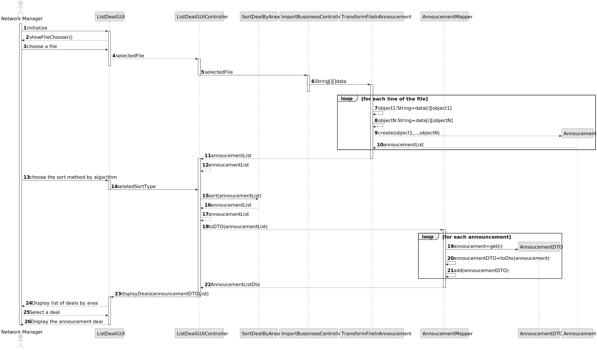
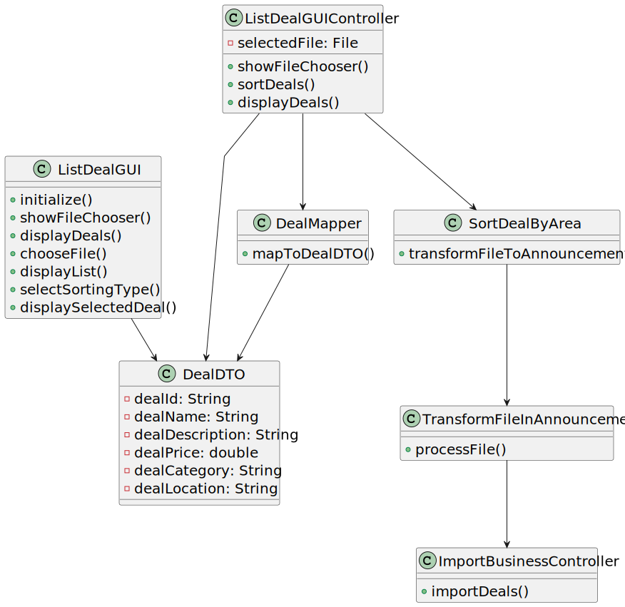

# US 017 - I want to respond to the user that scheduled the visit

## 3. Design - User Story Realization 

### 3.1. Rationale

**SSD - Alternative 1 is adopted.**

| Interaction ID                  | Question: Which class is responsible for...     | Answer                    | Justification (with patterns)                                                                                                                                                                                                                                                                                     |
|:--------------------------------|:------------------------------------------------|:--------------------------|:------------------------------------------------------------------------------------------------------------------------------------------------------------------------------------------------------------------------------------------------------------------------------------------------------------------|
| Step 1  	Initialize GUI	        | 	... initializing the GUI?             | ListDealGUI               | Pure Fabrication: ListDealGUI class is responsible for initializing the GUI component.                                                                                                                                                                                                                            |
| Step 2  Show file chooser		     | 							... showing the file chooser?                                         | ListDealGUI               | Pure Fabrication: ListDealGUI class is responsible for displaying the file chooser to the user.                                                                                                                                                                                                                   |
| Step 3  Choose a file		         | 	..                     ... handling the file selection?                        | GUIController             | Controller: GUIController class handles the interaction between the GUI and other components for file selection.                                                                                                                                                                                                  |
| Step 4  Process selected file		 | 	                       ... processing the selected file?                        | ImportController          | Controller: ImportController class coordinates the processing of the selected file.                                                                                                                                                                                                                               |
| Step 5  	Transform file data	   | 	             . transforming the file data?                                  |                           | Pure Fabrication: Transformer class is responsible for transforming the raw file data into announcement objects.                                                                                                                                                                                                  |
| Step 6  	Create announcement	   | 					... creating announcement objects?		                                         | Transformer, Announcement | Information Expert: Transformer collaborates with Announcement class to create announcement objects based on the transformed data.                                                                                                                                                                                |              
| Step 7  	Provide announcement list	                      | 	     .. providing the list of announcements?                                          |                           |                                                                                                                                                                                                                                                                                                                   | 
| 			 Select sort method 		                         | 	... handling the selection of the sort method? | ListDealGUI               |                                                                            Pure Fabrication: ListDealGUI class is responsible for displaying the available sort methods and receiving the selected sort type from the user.                                                                                       | 
| 			  Sort announcements		                         | 	... performing the sorting of announcements?   |        SortDeal                   | Creator: SortDeal class creates and performs the sorting of the announcement list based on the selected sort method.                                                                                                                                                                                              | 
| Step 8  		Map announcements to DTOs                      | 	... mapping announcements to DTOs?             | Mapper                    | Creator: Mapper class creates DTOs (Data Transfer Objects) by mapping the sorted announcements.                                                                                                                                                                                                                   | 
|                         Display sorted deals        | ... displaying the sorted deals?                | ListDealGUI               | Pure Fabrication: ListDealGUI class is responsible for displaying the sorted deals, using the DTOs provided by the Mapper.                                                                                                                                                                                        |
|                          Select a deal       | ... handling the selection of a deal?           | ListDealGUI               | Pure Fabrication: ListDealGUI class is responsible for allowing the user to select a specific deal from the displayed list.                                                                                                                                                                                       |
|                        Display selected deal         | ... displaying the selected deal?               | ADM                       | Pure Fabrication: ADM class is responsible for displaying the selected deal to the user.                                                                                                                                                                                                                          |

### Systematization ##

According to the taken rationale, the conceptual classes promoted to software classes are: 

 * Announcement
 * SortDeal
 * ImportBussinessController

Other software classes (i.e. Pure Fabrication) identified: 

 * ListDealGUI  
 * ListDealController

## 3.2. Sequence Diagram (SD)

This diagram shows the full sequence of interactions between the classes involved in the realization of this user story.

## 3.3. Class Diagram (CD)

