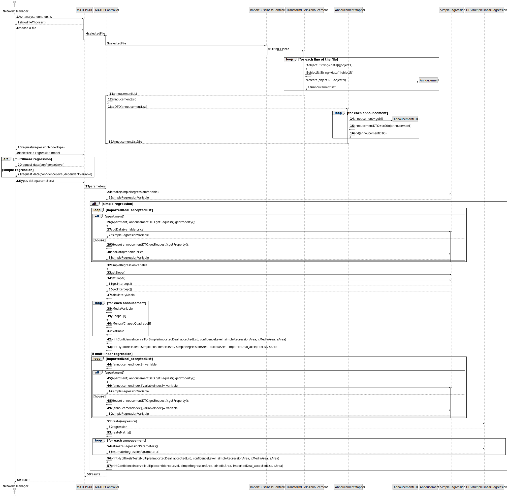
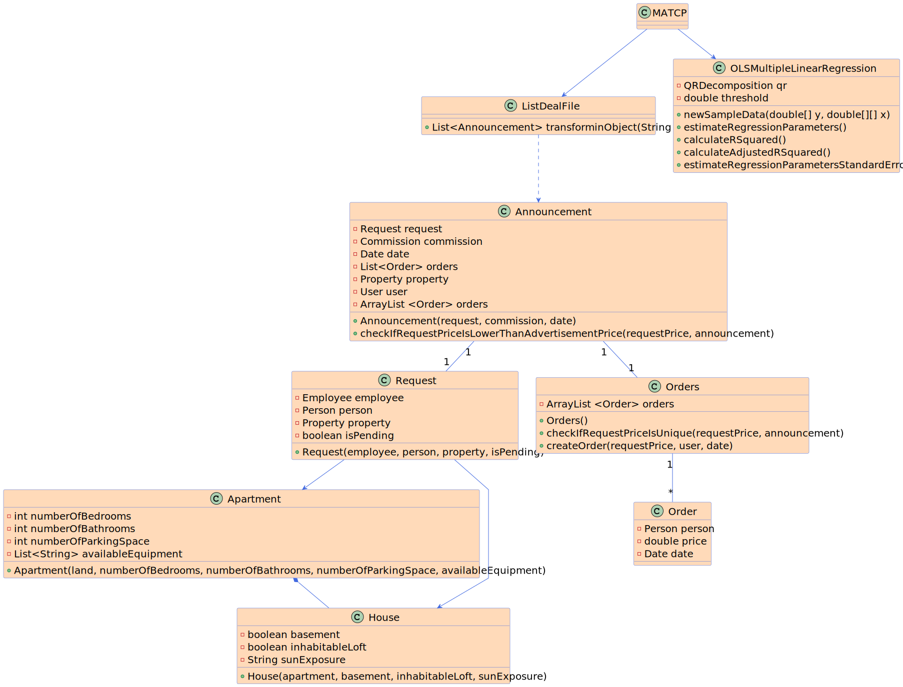

# US 018 - The prediction of the value of the business/property

## 3. Design - User Story Realization 

### 3.1. Rationale

| Interaction ID                                | Question: Which class is responsible for... | Answer                             | Justification (with patterns)                                                                                 |
|:----------------------------------------------|:--------------------------------------------|:-----------------------------------|:--------------------------------------------------------------------------------------------------------------|
| Step 1 - get csv file to analyse		            | 	... who get the scv file?                  | ListDealFile                       | Controller                                                                                                    |
| 		                                            | 	... where are save the data?               | MATCP                              | Pure Fabrication: there is no reason to assign this responsibility to any existing class in the Domain Model. |
| Step 2 - analyse the data                     | 	...what should be analyse                  | Order                              | Pure Fabrication: there is no reason to assign this responsibility to any existing class in the Domain Model. |
|                                               | 	...what should be analyse                  | quantity of each room in the house | Pure Fabrication: there is no reason to assign this responsibility to any existing class in the Domain Model. |
| Step 3 - choose regressions  		               | 	...interacting with the actor?             | MATCP                              | IE: is responsible for user interactions.                                                                     |
| Step 4 - realize simple regression  		        | 	...make calculations?                      | SimpleRegression                   | Pure Fabrication: there is no reason to assign this responsibility to any existing class in the Domain Model. |
| Step 5 - realize multipleLinear regression 		 | 	...make calculations?                      | OLSMultipleLinearRegression        | Pure Fabrication: there is no reason to assign this responsibility to any existing class in the Domain Model. |
| 		                                            | 	...make auxiliary calculations?            | TDistribution                      | Pure Fabrication: there is no reason to assign this responsibility to any existing class in the Domain Model. |
| Step 9 - informs operation success 		         | 	... informing operation sucess             | MATCP                              | IE: is responsible for user interactions.                                                                     |

### Systematization ##

According to the taken rationale, the conceptual classes promoted to software classes are: 

 * Agency 
 * Announcement
 * Order
 * Apartment
 * House
 * Land

Other software classes (i.e. Pure Fabrication) identified: 

 * MATCP  
 * ListDealFile
 * SimpleRegression
 * OLSMultipleLinearRegression
 * TDistribution

## 3.2. Sequence Diagram (SD)

This diagram shows the full sequence of interactions between the classes involved in the realization of this user story.

## 3.3. Class Diagram (CD)

