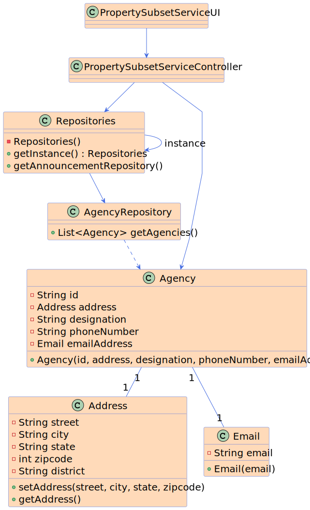

# US 010 - Place an order to purchase the property

## 3. Design - User Story Realization 

### 3.1. Rationale

| Interaction ID | Question: Which class is responsible for...        | Answer                          | Justification (with patterns)                                                                                 |
|:---------------|:---------------------------------------------------|:--------------------------------|:--------------------------------------------------------------------------------------------------------------|
| Step 1  		     | 	... interacting with the actor?                   | PropertySubsetServiceUI         | Pure Fabrication: there is no reason to assign this responsibility to any existing class in the Domain Model. |
| 			  		        | 	... coordinating the US?                          | PropertySubsetServiceController | Controller                                                                                                    |
| 			  		        | ... knowing the agencies using the system?         | AgencyRepository                | IE: cf. A&A component documentation.                                                                          |
| Step 2  		     | 	...knowing the Agency goes to a particular subset | PropertySubsetServiceController | Controller                                                                                                    |
| Step 3  		     | 	... who shows the subsets?                        | PropertySubsetServiceUI         | Pure Fabrication: there is no reason to assign this responsibility to any existing class in the Domain Model. |
| Step 4  		     | 	... informing operation success?                  | PropertySubsetServiceUI         | Pure Fabrication: there is no reason to assign this responsibility to any existing class in the Domain Model. | 

### Systematization ##

According to the taken rationale, the conceptual classes promoted to software classes are: 

 * AgencyDto
 * AddressDto
 * EmailDto

Other software classes (i.e. Pure Fabrication) identified: 

 * PropertySubsetServiceUI  
 * PropertySubsetServiceController
 * AgencyRepository

## 3.2. Sequence Diagram (SD)

### Alternative 1 - Full Diagram

This diagram shows the full sequence of interactions between the classes involved in the realization of this user story.

## 3.3. Class Diagram (CD)

